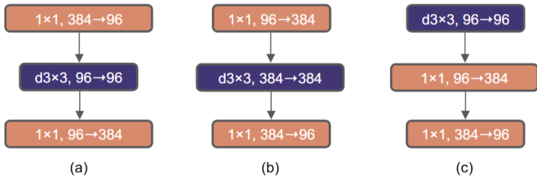
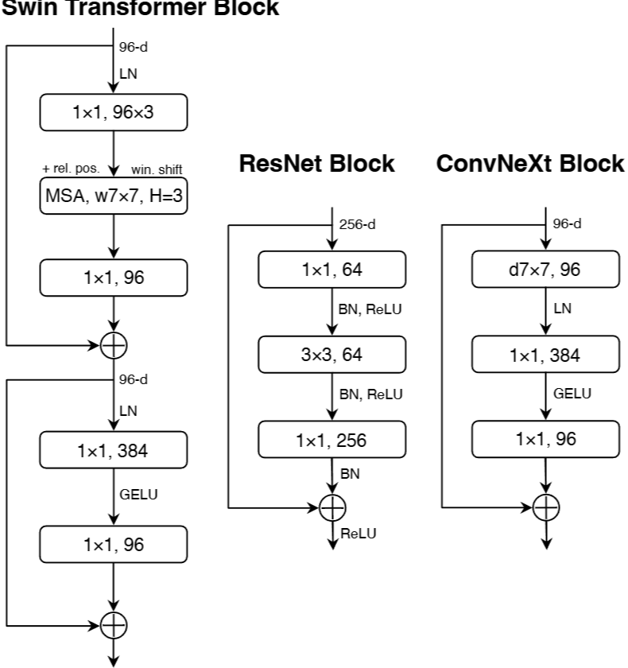
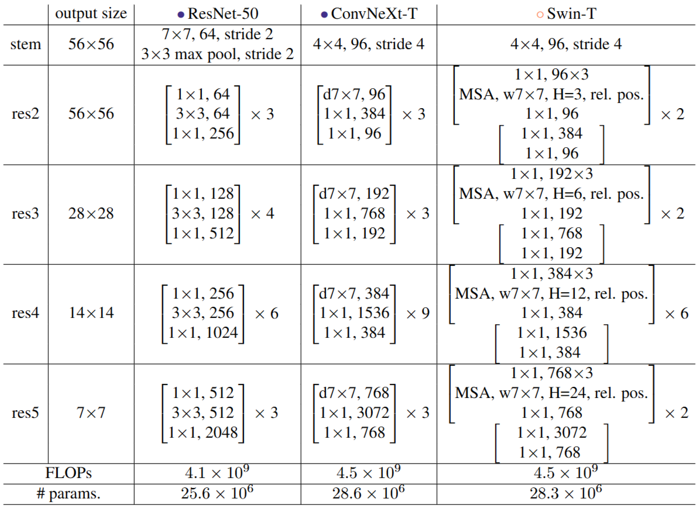
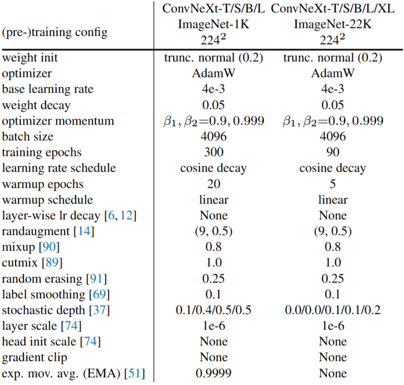
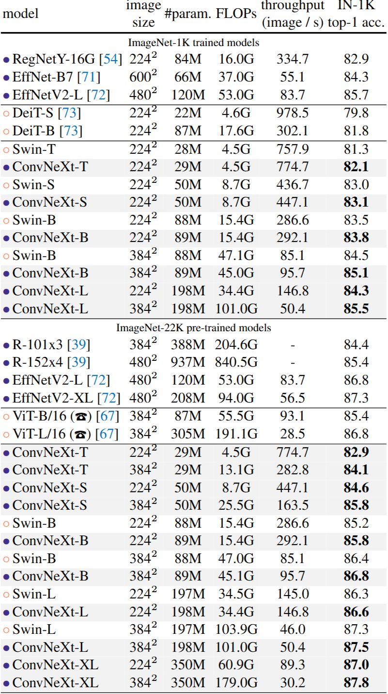

# 1. Paper Information

- Title: A ConvNet for the 2020s
- Paper URL: [https://arxiv.org/pdf/2201.03545]

---

# 2. Motivation

## Problem

- Swin의 sliding window(=shifted window)는 CNN과 비슷함
  - Swin의 W-MSA는 이미지의 local 정보에 집중하는 Convolution과 비슷함 즉, CNN은 좋은 방법임..!
    - 하지만 CNN은 `scaling behavior`가 트랜스포머 보다 안좋음
      - `scaling behavior` : 모델의 크기, 학습 데이터, 입력 해상도, 학습 계산량 등을 키웠을 때 성능이 효과적으로 증가하는가

## Goal

- pure CNN이지만 Swin의 구조를 수용해서 `scaling behavior` 약점을 극복해보자 !

## Core Idea

- stage ratio : 기존 (3,4,6,3) -> (3,3,9,3) or (3,3,27,3) 사용
  - swin의 (2,2,6,2) or (2,2,18,2) 처럼 3배 or 9배
  - 왜 (2,2,6,2) 안하고 (3,3,9,3)으로 함? -> transformer는 어텐션, feed-forward 등이 있어서 연산량이 더 많기 때문에 연산량을 비슷하게 맞추기 위함

- Patchify stem : 맨 처음 해상도 줄이는 과정을 4x4 conv(stride=4)로 대체
  - swin의 맨 처음이랑 동일하게 함

- 3 x 3 depthwise conv(ResNeXt 아이디어)를 사용해서 파라미터 수를 줄이고 이어서 1 x 1 separable conv(MobileNet V1 아이디어)로 채널 수를 늘림
  - ViT랑 비슷한 매커니즘임
    - depthwise conv : 공간(spatial) 정보만 봄 = self-attention
    - separable conv : 채널(channel) 정보만 봄 = Q,K,V 만들 때, MHA의 MLP, FeedForward

  - MHA로 공간 정보 연산 후 FeedForward에서 4배 늘렸다 줄이는 행위(c)

- Kernel size를 Swin의 Window size와 같은 7x7로 바꿈
  - 여러 사이즈를 테스트 해봤는데, 7x7이 가장 성능이 좋았음

- Activation 변경
  - ReLU -> GELU
  - 3번 -> 1번, Normalization도 1번
    - 정보 손실을 최소화 하기 위해서 채널 수를 늘린 후만 Activation 사용

- Downsampling을 Swin의 Patchmerging 처럼 블록 안에서 안하고 원할 때만 2x2 Conv(stride=2)를 사용
  - 훈련이 잘 안되서 앞에 LN 추가했더니 잘 됨
    - 이유는 명시해놓지 않았음

---

# 3. Model Architecture & Forward Process

## Overall Architecture

## Components

### ConvNeXt Block

**Purpose**
- 입력 feature map의 공간적 정보와 채널 정보를 효율적으로 변환합니다.
- Transformer block의 설계에서 영감을 받았지만, self-attention 없이 표준 convolution 연산만 사용합니다.

**Configuration**
- **Depthwise Convolution**: 각 채널별로 독립적인 $7 \times 7$ depthwise convolution을 적용하여 spatial mixing을 수행합니다.
- **Inverted Bottleneck**: 첫 번째 $1 \times 1$ convolution으로 채널 차원을 확장합니다.
- **GELU Activation**: 확장된 채널 feature에 GELU 활성화 함수를 한 번 적용합니다.
- **Pointwise Convolution**: 두 번째 $1 \times 1$ convolution으로 채널 차원을 원래 차원으로 축소합니다.
- **LayerNorm**: depthwise convolution 이후 채널 방향으로 LayerNorm을 적용합니다.
- **Residual Connection**: block의 입력을 변환된 출력에 더합니다.
- **Layer Scale**: residual branch에 초기값 $10^{-6}$의 Layer Scale을 적용합니다.

**Role**
- $7 \times 7$ depthwise convolution으로 주변 spatial 위치의 정보를 혼합합니다.
- $1 \times 1$ convolution으로 채널 간 정보를 혼합합니다.
- Spatial mixing과 channel mixing을 분리하여 Transformer의 block 구조와 유사한 연산 흐름을 구성합니다.
- Self-attention이나 shifted window와 같은 특수한 attention 모듈 없이 계층적 feature representation을 학습합니다.

**Output**
- 일반적인 ConvNeXt block은 입력과 동일한 해상도와 채널 수를 유지합니다.
- 입력과 출력의 형태는 다음과 같습니다.

$$
(B, H, W, C) \rightarrow (B, H, W, C)
$$

- Residual connection을 적용하기 위해 block 내부의 최종 채널 차원은 입력 채널 차원과 동일합니다.

### Downsampling Layer

**Purpose**
- Stage가 전환될 때 feature map의 spatial resolution을 낮춥니다.
- 해상도를 줄이는 동시에 채널 차원을 증가시켜 더 높은 수준의 특징을 추출합니다.

**Mechanism**
- $2 \times 2$ convolution과 stride $2$를 사용합니다.
- Downsampling layer를 residual block과 분리하여 독립적인 계층으로 구성합니다.
- 해상도가 변경되는 위치에 LayerNorm을 추가하여 학습을 안정화합니다.

**Role**
- ConvNet과 유사한 계층적 feature map을 생성합니다.
- 서로 다른 해상도의 feature map을 제공하여 object detection과 semantic segmentation 같은 downstream task에 활용할 수 있도록 합니다.

**Output**

$$
(B, H, W, C)
\rightarrow
(B, H/2, W/2, 2C)
$$

### Patchify Stem

**Purpose**
- 입력 이미지의 초기 spatial resolution을 줄이고, 첫 번째 feature map을 생성합니다.

**Mechanism**
- $4 \times 4$ convolution과 stride $4$를 사용합니다.
- 입력 이미지를 명시적인 token sequence로 변환하지 않고 convolution을 통해 feature map을 생성합니다.
- Stem 이후 LayerNorm을 적용합니다.

**Output**

$$
(B, H, W, 3)
\rightarrow
(B, H/4, W/4, 96)
$$

- ConvNeXt-T의 첫 번째 Stage에서는 채널 차원 $C=96$을 사용합니다.

## Forward Process

### 1. Patchify Stem

- 입력 이미지에 $4 \times 4$ convolution과 stride $4$를 적용합니다.
- 입력 이미지의 높이와 너비가 각각 $1/4$로 줄어듭니다.

$$
(B, H, W, 3)
\rightarrow
(B, H/4, W/4, 96)
$$

### 2. Stage 1

- 첫 번째 feature map에 ConvNeXt block을 반복적으로 적용합니다.
- ConvNeXt-T에서는 Stage 1에 $3$개의 block을 사용합니다.
- Feature map의 spatial resolution은 유지됩니다.

$$
(B, H/4, W/4, 96)
\rightarrow
(B, H/4, W/4, 96)
$$

### 3. Downsampling Layer 1

- Stage 1이 끝난 뒤 $2 \times 2$ convolution과 stride $2$를 적용합니다.
- 해상도는 절반으로 줄고 채널 수는 증가합니다.

$$
(B, H/4, W/4, 96)
\rightarrow
(B, H/8, W/8, 192)
$$

### 4. Stage 2

- ConvNeXt block을 반복적으로 적용하여 feature를 변환합니다.
- ConvNeXt-T에서는 Stage 2에 $3$개의 block을 사용합니다.

$$
(B, H/8, W/8, 192)
\rightarrow
(B, H/8, W/8, 192)
$$

### 5. Downsampling Layer 2

$$
(B, H/8, W/8, 192)
\rightarrow
(B, H/16, W/16, 384)
$$

### 6. Stage 3

- ConvNeXt-T에서는 Stage 3에 $9$개의 ConvNeXt block을 사용합니다.
- 네 개의 Stage 중 가장 많은 block을 배치하여 계산량을 집중합니다.

$$
(B, H/16, W/16, 384)
\rightarrow
(B, H/16, W/16, 384)
$$

### 7. Downsampling Layer 3

$$
(B, H/16, W/16, 384)
\rightarrow
(B, H/32, W/32, 768)
$$

### 8. Stage 4

- ConvNeXt-T에서는 Stage 4에 $3$개의 ConvNeXt block을 사용합니다.
- 최종 고수준 semantic feature를 생성합니다.

$$
(B, H/32, W/32, 768)
\rightarrow
(B, H/32, W/32, 768)
$$

### 9. Head

- 마지막 Stage의 feature map에 global average pooling을 적용합니다.
- Global average pooling 이후 최종 feature는 ConvNeXt-T의 마지막 채널 차원인 $768$이 됩니다.
- 이후 선형 분류기를 통해 ImageNet-1K의 $1{,}000$개 클래스에 대한 예측을 수행합니다.

$$
(B, H/32, W/32, 768)
\rightarrow
(B, 768)
\rightarrow
(B, 1000)
$$

## ConvNeXt-T 전체 구조 요약

| 단계 | 연산 | Block 수 | 출력 해상도 | 출력 채널 |
|---|---|---:|---:|---:|
| Stem | $4 \times 4$ convolution, stride $4$ | - | $H/4 \times W/4$ | $96$ |
| Stage 1 | ConvNeXt block | $3$ | $H/4 \times W/4$ | $96$ |
| Downsampling 1 | $2 \times 2$ convolution, stride $2$ | - | $H/8 \times W/8$ | $192$ |
| Stage 2 | ConvNeXt block | $3$ | $H/8 \times W/8$ | $192$ |
| Downsampling 2 | $2 \times 2$ convolution, stride $2$ | - | $H/16 \times W/16$ | $384$ |
| Stage 3 | ConvNeXt block | $9$ | $H/16 \times W/16$ | $384$ |
| Downsampling 3 | $2 \times 2$ convolution, stride $2$ | - | $H/32 \times W/32$ | $768$ |
| Stage 4 | ConvNeXt block | $3$ | $H/32 \times W/32$ | $768$ |
| Head | Global average pooling 및 linear classifier | - | - | $1{,}000$ classes |

---

# 4. Mathematical Explanation (New Ideas)

---

# 5. Training Configuration

---

# 6. Implementation

## Directory Structure

ConvNeXt/
├── README.md
├── model.py
└── main.py

## Model Implementation

- **Swin Transformer Architecture**
  - 논문의 계층적 구조를 `BasicLayer`와 `PatchMerging` 클래스로 나누어 구현함.
  - Swin-T 설정은 `embed_dim=96`, `depths=(2, 2, 6, 2)`, `num_heads=(3, 6, 12, 24)`로 지정함.

- **Patch Embedding**
  - 논문의 Patch Partition과 Linear Embedding을 `nn.Conv2d` 하나로 구현함.

- **Window-based Multi-Head Self-Attention**
  - 논문의 윈도우 단위 어텐션을 `window_partition()`과 `WindowAttention` 클래스로 구현함.

- **Relative Position Bias**
  - 논문의 상대적 위치 편향을 `relative_position_bias_table`과 `relative_position_index`로 구현함.

- **Shifted Window Attention**
  - 논문의 일반 윈도우와 Shifted Window 교대 방식을 `shift_size=0`과 `shift_size=window_size // 2`로 구현함.
  - `torch.roll()`을 사용해 특징 맵을 순환 이동하고, `create_attention_mask()`로 윈도우 경계를 넘는 잘못된 어텐션을 차단함.

- **Swin Transformer Block**
  - 논문의 두 개의 연속된 Swin Transformer Block을 `SwinTransformerBlock` 클래스로 구현함.
  - 각 블록에 `LayerNorm`, 어텐션, MLP, 잔차 연결을 적용함.
  - `BasicLayer`에서 블록 인덱스에 따라 일반 윈도우와 Shifted Window를 번갈아 배치함.

- **MLP Block**
  - 논문의 두 층 MLP와 GELU 활성화 함수를 `MLP` 클래스로 구현함.
  - 중간 차원은 `int(dim * mlp_ratio)`로 계산하며 기본 확장 비율은 `4.0`임.

- **Token Embedding**
  - 논문의 패치 토큰 생성을 `patch_embed`의 `nn.Conv2d`와 `patch_norm`의 `LayerNorm`으로 구현함.

- **Patch Merging**
  - 논문의 인접한 패치 병합을 `PatchMerging` 클래스로 구현함.
  - `x0`, `x1`, `x2`, `x3`로 네 위치의 패치를 추출한 뒤 `torch.cat()`으로 결합하고, 선형 변환을 통해 채널 차원을 변경함.

- **Weight Initialization**
  - 논문의 초기화 설정을 `_init_weights()`에 구현함.

## Verification

| Item | 구현 방식 |
| :--- | :--- |
| Input Shape | `torch.randn(1, 3, 224, 224)`로 테스트함 |
| Output Shape | 분류 헤드의 출력 `[1, 1000]` 확인함 |
| Total Parameters | 28,288,354 |
| FLOPs | 4509194496 |

---

# 7. Analysis & Insights

  - 모델 및 데이터 규모를 키울수록 성능이 좋아짐
  - 전체적으로 Swin 보다 성능 우수
  - EfficientNet V2 보다도 성능은 우수하지만 속도는 뒤쳐짐

- CNN도 scalable 할 수 있다는 것을 보인 연구지만 Swin과 EfficientNet 보다 훨씬 좋은 것은 아님
- AI의 지속적인 발전을 생각했을 때(multi-modal) 역시 Transformer가 좋은듯..

## Merits

- **기존 ViT보다 효율적인 고해상도 처리**
  - 기존 ViT는 전체 패치에 전역 셀프 어텐션을 적용해 입력 크기에 따라 연산량이 제곱으로 증가함.
  - Swin Transformer는 고정된 윈도우 내부에서만 어텐션을 계산해 입력 이미지 크기에 대해 선형적인 연산 복잡도를 달성함.

- **기존 ViT보다 다양한 비전 작업에 적합함**
  - 기존 ViT는 단일 해상도의 특징 맵을 생성해 객체 탐지나 시맨틱 세그멘테이션에 직접 적용하기 어려움.
  - Swin Transformer는 Patch Merging을 통해 CNN과 유사한 계층적 다중 해상도 특징 맵을 생성함.

- **기존 CNN 백본과 비교해 경쟁력 있는 성능을 보임**
  - 논문 실험에서 Swin-T는 비슷한 계산량의 ResNet-50보다 여러 객체 탐지 프레임워크에서 더 높은 성능을 보임.
  - Swin Transformer는 ImageNet 분류뿐 아니라 COCO 객체 탐지와 ADE20K 시맨틱 세그멘테이션에서도 강한 성능을 보임.

## Demerits

- **단순한 ViT보다 구현이 복잡함**
  - ViT의 전역 어텐션보다 window partition, cyclic shift, attention mask, Patch Merging을 추가로 구현해야 함.

## Why?

- **왜 Shifted Window가 필요한가?**
  - 고정된 윈도우만 사용하면 윈도우 경계에서 정보가 단절됨.
  - Shifted Window는 다음 블록에서 분할 기준을 바꾸는데 이걸 반복하면서 점차 전역적인 정보를 볼 수 있게됨

---