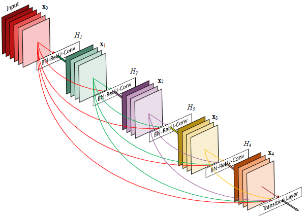
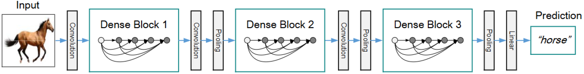
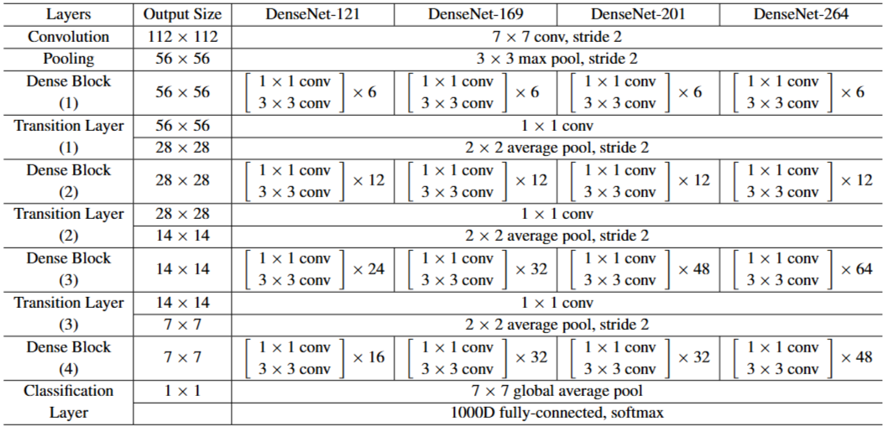

# 1. Paper Information

- Title: Densely Connected Convolutional Networks
- Paper URL: [https://arxiv.org/pdf/1608.06993]

---

# 2. Motivation

## Problem

- 심층 신경망(Deep Convolutional Neural Networks)의 깊이가 깊어질수록 `Venishing Gredient` 문제가 발생함
    - 기존의 연구는 이러한 문제를 해결하기 위해 `Skip Connection`을 사용했지만, 정보를 합산(summation)하는 방식이라 정보 흐름을 방해할 가능성이 있음

## Goal

- 네트워크의 각 층 간에 정보 흐름을 극대화하기 위해, 동일한 특징 맵(feature-map) 크기를 가진 모든 층을 직접 연결하는 새로운 아키텍처를 설계함
    - 층이 깊어지더라도 효율적인 학습이 가능하고, 매개변수 효율성을 극대화하며, 과적합(overfitting)을 방지하는 모델을 구축하고자 함

---

# 3. Core Idea

- 각 계층은 이전의 모든 계층에서 생성된 특징 맵(feature-map)을 입력으로 받는다
    - 연결의 수가 기존엔 `L`개 였다면, 해당 방법으로는 `L(L+1)/2`개로 증가
- ResNet의 `summation` 방식이 아닌 채널 축으로 이어붙이는 `concatenation` 방식 사용
- 각 층이 생성하는 특징 맵의 수를 k라고 할 때, DenseNet은 기존 아키텍처에 비해 `k=12`을 사용하더라도 충분히 우수한 성능을 내며, 이는 네트워크 전체의 특징을 효율적으로 공유하기 때문이다.

---

# 4. Model Architecture & Forward Process

## Overall Architecture

- 
- 
- 

---

## Components

### Conv7×7
**Purpose**
- 입력 이미지의 저수준 특징 추출 및 초기 해상도 감소

**Configuration**
- Kernel Size : 7×7
- Stride : 2
- Padding : 3
- Activation : ReLU
- Normalization : Batch Normalization

**Role**
- 입력 이미지(224×224)의 초기 특징을 빠르게 추출하며 해상도를 절반으로 감소

**Output**
- (B, 64, 112, 112)

### Dense Block
**Purpose**
- 입력받은 특징 맵을 채널 방향으로 이어 붙여(Concatenation) 정보 흐름의 극대화

**Configuration**
- Composite Function: BN - ReLU - Conv(1×1) - BN - ReLU - Conv(3×3)
- 각 층마다 k개의 특징 맵을 추가

**Role**
- 앞선 모든 층의 출력을 입력으로 사용하여 특징 재사용(Feature Reuse)을 극대화하고 깊은 네트워크에서의 정보 소실 방지

**Output**
- (B, C_in+k*L, H, W) (여기서 L은 블록 내 층의 수)

### Transition Layer
**Purpose**
- 서로 다른 크기의 특징 맵을 가진 Dense Block 사이의 해상도 조절 및 압축

**Configuration**
- Batch Normalization, 1×1 Convolution, 2×2 Average Pooling

**Role**
- 특징 맵의 개수를 조절하고(Compression) 공간적 해상도를 절반으로 감소(Downsampling)시켜 모델의 컴팩트함 유지

**Output**
- (B, θ*C_{in}, H/2, W/2)
    - θ : 압축계수
    - 0 < θ <= 1
    - 원문에선 0.5 사용

### Global Average Pooling (GAP)
**Purpose**
- 최종 Feature Map의 공간 정보를 요약하여 1차원 벡터로 변환

**Role**
- Fully Connected Layer의 매개변수 수를 획기적으로 줄이며 과적합 억제

**Output**
- (B, C, 7, 7) → (B, C)

### FC Layer & Softmax
**Purpose**
- 최종 특징 벡터를 기반으로 클래스별 Logit을 계산하고 확률 분포 산출

**Role**
- 클래스 분류를 위한 최종 확률 분포 생성

---

## Forward Process (DenseNet-121 기준)

### 1. Input
(B, 3, 224, 224)

### 2. Conv7×7 + MaxPool
(B, 3, 224, 224)  
↓ BN -> ReLU -> Conv7×7  
(B, 64, 112, 112)  
↓ MaxPool (3×3, stride 2)  
(B, 64, 56, 56)

### 3. Dense Block (1)
(B, 64, 56, 56)  
↓ 6 layers  
(B, 256, 56, 56)

### 4. Transition Layer (1)
(B, 256, 56, 56)  
↓ 1×1 Conv + AvgPool  
(B, 128, 28, 28)

### 5. Dense Block (2)
(B, 128, 28, 28)  
↓ 12 layers  
(B, 512, 28, 28)

### 6. Transition Layer (2)
(B, 512, 28, 28)  
↓ 1×1 Conv + AvgPool  
(B, 256, 14, 14)

### 7. Dense Block (3)
(B, 256, 14, 14)  
↓ 24 layers  
(B, 1024, 14, 14)

### 8. Transition Layer (3)
(B, 1024, 14, 14)  
↓ 1×1 Conv + AvgPool  
(B, 512, 7, 7)

### 9. Dense Block (4)
(B, 512, 7, 7)  
↓ 16 layers  
(B, 1024, 7, 7)

### 10. Global Average Pooling
(B, 1024, 7, 7)  
↓ GAP  
(B, 1024)

### 11. FC-1000 & Softmax
(B, 1024)  
↓ FC  
(B, 1000)  
↓ Softmax  
(B, 1000)

# 5. Mathematical Explanation

- Dense block 내부의 `l`번째 층의 입력 채널 수 : `k_0 + k(l - 1)`
    - `l`번째 층의 입력 채널 수는 이전 층들의 출력 채널 합과 같음
    - 각 층의 특징 맵 출력 수 : `k`
    - k_0 : 네트워크의 입력 채널 수

- Nesterov Momentum (NAG)
    - 관성 방향으로 이동해 본 미래 위치에서 기울기를 계산하여 최적화를 수행하는 방식

    $$v_t = \gamma v_{t-1} + \eta \nabla_\theta J(\theta_t - \gamma v_{t-1})$$
    $$\theta_{t+1} = \theta_t - v_t$$

    - $\theta_t$: 현재 위치(가중치 파라미터)
    - $v_t$: $t$ 시점의 속도(관성)
    - $\gamma$: 모멘텀 계수(마찰 계수), 보통 $0.9$ 사용
    - $\eta$: 학습률(Learning Rate)
    - $\nabla_\theta J(\dots)$: 특정 위치에서의 손실 함수 $J$에 대한 기울기(Gradient)
    - $\theta_t - \gamma v_{t-1}$: **Look-ahead 위치** (현재 속도만큼 미리 이동한 지점)

    - 장점:
        - **미리 보기(Look-ahead)**를 통해 오버슈팅(Overshooting)을 방지하고 급격한 기울기 변화에 안정적으로 대응
        - 일반 모멘텀 대비 빠른 수렴 속도와 학습 안정성 확보

---

# 6. Training Configuration

| Item | Value |
|------|-------|
| Input Size | 224 × 224 |
| Optimizer | mini-batch SGD |
| Batch Size | 256 |
| Initial LR | 0.1 |
| LR Scheduling | Decreased by 10 at 30, 60 epochs |
| Total Epochs | 90 |
| Nesterov Momentum | 0.9 |
| Weight Decay | 1e-4 |
| Dropout | 0.2 (CIFAR/SVHN) / 0 (ImageNet) |
| Loss | Cross Entropy |
| Initialization | He Initialization |

## Notes
- **LR Scheduling**: 초기 학습률 0.1에서 시작하여 전체 학습의 1/3 지점(30 epoch)과 2/3 지점(60 epoch)에서 10배씩 감소시킴
- **Dropout**: 데이터셋의 크기가 작은 CIFAR-10/100, SVHN의 경우 과적합 방지를 위해 0.2의 Dropout rate을 적용하지만, ImageNet 실험에서는 언급되지 않았음
- **Optimization**: Nesterov Momentum(0.9)을 사용하며, dampening은 적용하지 않았음

## Data Preprocessing
| Item | Description |
|------|-------------|
| Normalization | Channel-wise Mean & Std normalization (CIFAR) or 0~1 Scaling (SVHN) |
| Augmentation | Standard Augmentation (Random Mirroring & Shifting) |
| Non-Augmented | SVHN dataset (No augmentation applied) |

---

# 7. Implementation

## Directory Structure

DenseNet/
├── README.md
├── model.py
└── main.py

## Model Implementation

- `stem`, `stage1`~`stage4`, `classifier`를 각각 모듈 단위로 구현
    - stem : 초기 Feature를 추출하는 7×7 Convolution과 Max Pooling
    - stage1~stage4 : Dense Layer와 Transition Layer로 구성
    - classifier : Global Average Pooling 이후 Fully Connected Layer

- Dense Layer는 논문과 동일하게 Bottleneck 구조(`1×1 Conv → 3×3 Conv`)를 사용하여 구현
    - 1×1 Convolution으로 Channel 수를 `4 × Growth Rate`로 변경
    - 3×3 Convolution으로 새로운 Feature를 생성

- 각 Dense Layer에서 생성된 Feature를 이전 Feature와 Channel 방향(`torch.cat`)으로 Concatenate하여 Feature Reuse를 구현

- Transition Layer는 `1×1 Convolution + Average Pooling`으로 구현
    - Compression Factor(θ=0.5)를 적용하여 Channel 수를 절반으로 감소
    - Average Pooling으로 Feature Map의 공간 크기를 절반으로 감소

- Dense Block(Stage)의 Forward 과정을 `forward_stage()` 함수로 분리하여 코드 중복을 제거하고 각 Stage를 동일한 방식으로 처리하도록 구현

- 마지막 Feature Map은 `nn.AdaptiveAvgPool2d((1, 1))`을 사용하여 입력 해상도와 관계없이 1×1 Feature Map으로 변환한 뒤 Fully Connected Layer를 통해 최종 분류를 수행하도록 구현

- Weight Initialization은 He Initialization(`Kaiming Normal`)을 적용하였으며, Bias는 0으로 초기화함

## Verification

| Item | Result |
|------|--------|
| Input Shape | [2, 3, 224, 224] |
| Output Shape | [2, 1000] |
| Total Parameters | 7,976,686 |

## Notes

- DenseNet-121 구조를 PyTorch로 Scratch 구현
- Growth Rate(`k=32`)를 논문과 동일하게 적용
- 실제 데이터셋을 사용하지 않았으며, 랜덤 입력을 이용하여 모델 구조를 검증

---

# 8. Analysis

## merits
- Gradient 전달이 매우 좋음
- 적은 파라미터로 높은 정확도

## demerits
- 메모리를 너무 많이 사용함
- Skip Connection 대비 연산이 비효율적임
    - Concat으로 메모리 복사 비용이 발생

---

# 9. Personal Insights

- 현대 모델들은 왜 DensNet 방식보다 ResNet 방식의 Skip Connection을 사용할까?
    - Concat 방식은 현대의 대규모 모델들에서 사용하기에는 메모리와 연산 효율 문제가 치명적임
    - Skip Connection의 `+` 연산이 Transformer 모델에서 각 사용자의 입력에 따라서 같은 답변일지라도 말투 등이 다른 결과를 내놓는 핵심 아이디어가 되는 것 같음

---