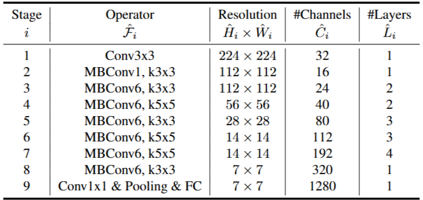

# 1. Paper Information

- Title: EfficientNet: Rethinking Model Scaling for Convolutional Neural Networks
- Paper URL: [https://arxiv.org/pdf/1905.11946]

---

# 2. Motivation

## Problem
- 기존의 모델들은 고정된 자원 예산 내에서 개발된 후 정확도를 높이기 위해 임의로 모델 크기를 확장해왔으며, 네트워크의 깊이(depth), 너비(width), 해상도(resolution)라는 세 가지 차원을 균형 있게 조절하는 체계적인 방법에 대한 이해가 부족함
    - 깊이(depth) = 층 수
    - 너비(width) = 채널 수
    - 해상도(resolution) = 입력 이미지의 width, height

## Goal
- 네트워크의 깊이, 너비, 해상도를 고정된 비율로 균형 있게 조절하는 원칙적인 '복합 스케일링(Compound Scaling)' 방법을 정립하여, 자원 제약 조건 내에서 정확도와 효율성을 동시에 극대화함

---

# 3. Core Idea

# 3. Core Idea

- **복합 스케일링(Compound Scaling) 방법론**
  - 네트워크의 깊이($d$), 너비($w$), 해상도($r$)를 개별적으로 확장하는 대신, 단일 복합 계수 $\phi$를 사용하여 세 차원을 고정된 비율로 동시에 확장함으로써 기존의 단일 차원 확장보다 훨씬 높은 효율성과 정확도를 달성함.
  - 관련 공식: $d = \alpha^\phi, w = \beta^\phi, r = \gamma^\phi$ (단, $\alpha \cdot \beta^2 \cdot \gamma^2 \approx 2$)

- **효율적인 아키텍처 구현 전략**
  - **기반 네트워크 설계**: 다목적 신경망 구조 탐색(Multi-objective NAS)을 통해 최적의 모바일용 베이스라인인 **EfficientNet-B0**를 설계함.
  - **효율적 연산 블록**: 네트워크의 기본 단위로 모바일 역병목(MBConv) 블록을 채택하고, 여기에 Squeeze-and-Excitation(SE) 최적화를 결합하여 연산 효율을 극대화함.

---

# 4. Model Architecture & Forward Process

## Overall Architecture

## Components

### MBConv Block (Inverted Residual + SE)
**Purpose**
- 모바일 역병목 구조를 기본 단위로 사용하며, Squeeze-and-Excitation(SE) 모듈을 결합하여 채널 간 의존성을 모델링함으로써 모델의 표현력을 강화함

**Configuration**
- **Expansion (1×1 Conv)**: 입력 채널을 더 높은 차원으로 확장하여 특징 공간을 넓힘
- **Depthwise Conv (3×3 or 5×5)**: 확장된 특징 공간에서 공간적 특징을 효율적으로 추출
- **Squeeze-and-Excitation**: 전체 채널의 중요도를 재계산(Recalibration)하여 유의미한 특징을 강조
- **Pointwise Conv (1×1)**: 채널을 줄여 원래의 차원(또는 타겟 차원)으로 복원하며 잔차 연결(Residual Connection) 수행

**Role**
- 좁은 병목 계층(Bottleneck)을 연결하는 잔차 연결을 통해 학습 효율을 높이고, SE 블록을 통해 네트워크가 중요한 특징에 집중하도록 유도함

**Output**
- (B, $C_{out}$, $H/s$, $W/s$)

### Compound Scaling ($\alpha^\phi, \beta^\phi, \gamma^\phi$)
**Purpose**
- 네트워크의 깊이(Depth), 너비(Width), 해상도(Resolution)를 개별적으로 확장하는 대신, 복합 계수 $\phi$를 도입하여 세 차원을 고정된 비율로 균형 있게 확장함

**Mechanism**
- **Depth ($\alpha^\phi$)**: 계층 수 조정
- **Width ($\beta^\phi$)**: 채널 수 조정
- **Resolution ($\gamma^\phi$)**: 입력 해상도 조정
- **Constraint**: 연산량 증가를 제어하기 위해 $\alpha \cdot \beta^2 \cdot \gamma^2 \approx 2$ 조건을 유지하며, 자원 예산 증가에 따라 $\phi$를 결정함

**Role**
- 단일 차원 확장 시 발생하는 정확도 포화 문제를 해결하고, 네트워크의 모든 차원이 상호 보완적으로 성장하도록 하여 자원 효율성 내에서 모델의 성능을 극대화함

## Forward Process

### 1. Input
(B, 3, $224 \cdot r$, $224 \cdot r$)

### 2. Stem Layer
(B, 3, $224 \cdot r$, $224 \cdot r$)  
↓ Conv3×3 (stride 2) + BN + Swish  
(B, 32 $\cdot w$, $112 \cdot r$, $112 \cdot r$)

### 3. MBConv Blocks (Scaling stages)
복합 스케일링 규칙에 따라 조정된 필터 수와 반복 횟수($L$)를 가진 MBConv 블록들을 순차적으로 통과함  
(모든 MBConv 블록은 Squeeze-and-Excitation(SE)을 포함하며 Swish 활성화 함수를 사용)

### 4. Efficient Head
특징을 요약하고 최종 차원으로 투영하는 단계  
↓ Conv1×1 (확장) + BN + Swish  
↓ Global Average Pooling (GAP)  
↓ Fully Connected(FC) Layer (최종 출력층)  
(B, 1280 $\cdot w$)

### 5. Classification
↓ Softmax  
(B, 1000)

*   **참고**: EfficientNet은 모든 레이어에서 활성화 함수로 Swish를 일관되게 사용

---

# 5. Mathematical Explanation (New Ideas)

---

# 6. Training Configuration

| Item | Value |
|------|-------|
| Optimizer | RMSProp |
| Decay | 0.9 |
| Momentum | 0.9 |
| Weight Decay | 1e-5 |
| Initial Learning Rate | 0.256 |
| Learning Rate Decay | 0.97 every 2.4 epochs |
| Batch Norm Momentum | 0.99 |
| Activation | SiLU(Swish-1) |

## Notes
- **Regularization**: 
    - 모델 규모에 따라 Dropout 비율을 선형적으로 증가시킴 (B0의 0.2에서 B7의 0.5까지).
    - Stochastic Depth(Survival probability 0.8)를 적용하여 과적합을 방지함.
        - 20% 확률로 Layer을 죽임
        - Layer가 살았을 때는 Residual Skip Connection 수행
            - y = F(x) + x
        - Layer가 죽었을 때는 Skip Connection 수행
            - y = x
- **Early Stopping**: 훈련 데이터셋 중 25K를 별도의 'minival' 세트로 구성하여 조기 종료(Early Stopping)를 수행함.

## Data Preprocessing
| Item | Description |
|------|-------------|
| Preprocessing | 학습 시 입력 해상도는 각 모델별 스케일링 설정에 따름 (예: B0는 224x224, B7은 600x600) |
| Augmentation | 학습 시 일반화 성능 향상을 위해 AutoAugment 정책을 기본적으로 적용함 |

# 7. Implementation

## Directory Structure

EfficientNet/
├── README.md
├── model.py
└── main.py

## Model Implementation

- EfficientNet-B0 Architecture를 PyTorch로 Scratch 구현
- Residual Connection은 `stride=1`이고 입력/출력 채널 수가 동일한 경우에만 적용
- Stochastic_depth는 Residual Connection 적용할 때만 적용
    - Residual Connection이 없을 때 적용하면 출력값이 0이 되기 때문에 학습이 진행은 되지만 망함
        - xW+b = 0W+b = b
            - b 값만 가지고 학습 진행됨 ..
- Weight Initialization
  - Convolution Layer : Kaiming Normal Initialization (`fan_out`)
  - Linear Layer : Uniform Initialization (`±1 / √out_features`)
  - Bias : 0으로 초기화

## Verification

| Item | Result |
|------|--------|
| Input Shape | [1, 3, 224, 224] |
| Output Shape | [1, 1000] |
| Total Parameters | 5,288,548 |
| FLOPs | 421,872,480 |

## Notes

- EfficientNet 논문에서는 Width Multiplier 적용 시 채널 수를 단순히 곱하지 않고 `make_divisible()`을 사용하여 8의 배수로 반올림한다. 현재 구현은 `int(channel × width_mult)`를 사용하였다.
- 논문에서는 Block이 깊어질수록 Stochastic Depth 확률을 선형적으로 증가시키지만, 현재 구현은 모든 MBConv Block에 동일한 확률(`0.2`)을 적용하였다.
- B0 기준(`width_mult=1.0`, `depth_mult=1.0`)에서는 Compound Scaling의 구조가 논문와 동일하게 동작한다.

---

# 8. Analysis

## Merits

- **효율적인 정보 보존 (Linear Bottlenecks)**
    - 좁은 병목 계층에서 비선형성을 제거하여 정보 손실을 방지하고, 고차원 확장을 통해 네트워크의 표현력을 최적화함.

- **메모리 최적화 (Inverted Residuals)**
    - 인버티드 잔차 연결을 통해 추론 시 메모리 점유율을 최소화하여, 메모리 대역폭이 제한된 모바일 환경에서 유리한 구조를 제공함.

- **유연한 하이퍼파라미터**
    - Width/Resolution Multiplier를 통해 하드웨어 제약에 맞춰 모델 크기와 지연 시간을 자유롭게 조절함.

- **하드웨어 친화적 설계 (h-swish & SE)**
    - 지수 연산이 포함된 $swish$를 하드웨어에서 매우 빠른 `h-swish`로 대체하고, SE 모듈의 병목 크기를 고정하여 하드웨어 가속기에서의 지연 시간을 최적화함.

## why?

- 깊이, 너비, 해상도를 왜 셋 다 키워야됨?
    - 해상도가 224*224 -> 1000*1000으로 커졌다면
        - 깊이도 커져야됨 -> 그래야 receptive field도 커져서 큰 해상도에 있는 많은 정보를 뽑아 먹을 수 있으니까
        - 너비도 커져야됨 -> 정보가 많은 만큼 필터의 갯수도 많아야 더 많은 특징을 뽑을 수 있으니까  

# 9. Personal Insights

- 하드웨어 친화적 설계: 단순히 연산량을 줄이는 것을 넘어, 실제 CPU/NPU가 처리하기 가장 쉬운 구조(h-swish, 고정된 SE 비율 등)를 찾아내는 것이 속도 향상의 핵심임

- 구조적 타협과 보완: 하드웨어 효율을 위해 일부 수학적 정교함(예: 시그모이드, 병목부 ReLU 제거)을 포기하는 대신, 채널 확장이나 연산 순서 재배치로 성능 저하를 막음

---