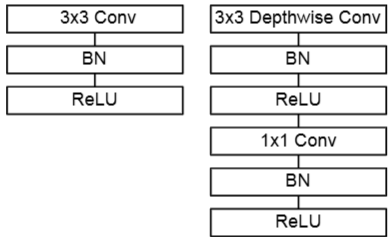
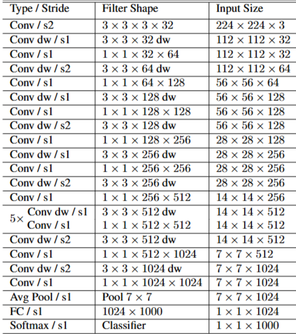

# 1. Paper Information

- Title: MobileNets: Efficient Convolutional Neural Networks for Mobile Vision
Applications
- Paper URL: [https://arxiv.org/pdf/1704.04861]

---

# 2. Motivation

## Problem

- 컴퓨터 비전 분야에서 딥러닝 모델의 정확도를 높이기 위해 신경망을 더 깊고 복잡하게 만드는 경향이 지속되어 왔음
- 하지만 이러한 구조적 복잡성 증가는 모델의 크기나 추론 속도 면에서 효율성을 고려하지 않아, 실시간성이 중요한 환경에서 적용하기 어렵다는 문제가 있음
- 로봇 공학, 자율 주행, 증강 현실과 같은 실제 서비스 환경에서는 계산 자원이 제한적인 플랫폼에서도 신속한 인식을 수행해야 함

## Goal

- 모바일 및 임베디드 기기의 하드웨어 제약 조건에 맞출 수 있는 작고 빠른 효율적인 신경망 아키텍처를 설계하는 것
- 단순히 모델의 크기만 줄이는 것이 아니라, 추론 지연 시간(latency)을 최적화하고 사용자가 자원 제한에 따라 모델을 선택할 수 있는 유연성을 제공하는 것

---

# 3. Core Idea

- Depthwise Separable Convolution : 공간 정보 연산과 채널 정보 연산을 두 단계로 분리하여 계산량을 획기적으로 줄이는 구조
    - Depthwise Convolution : 각 입력 채널에 대해 단일 필터를 적용하여 공간적 특징을 추출
    - Pointwise Convolution : $1 \times 1$ 합성곱을 사용하여 Depthwise 계층의 출력 값들을 `Weighted Sum`
- Width Multiplier ( $\alpha$) : 네트워크의 모든 계층에서 채널 수를 일정 비율로 줄여 모델의 크기와 연산량을 줄이는 하이퍼파라미터
    - 입력 채널 $M$과 출력 채널 $N$을 각각 $\alpha M$, $\alpha N$으로 스케일링하며, 연산 비용은 대략 $\alpha^2$에 비례하여 감소함
- Resolution Multiplier ( $\rho$) : 입력 이미지의 해상도를 조절하여 내부 계층의 연산량을 줄이는 하이퍼파라미터
    - 모델의 입력 해상도를 $224, 192, 160, 128$ 등으로 설정하여 연산 비용을 $\rho^2$만큼 효율적으로 조절할 수 있음

---

# 4. Model Architecture & Forward Process

## Overall Architecture

- 
- 

---

## Components

### Depthwise Separable Convolution Block
**Purpose**
- 표준 컨볼루션을 Depthwise와 Pointwise 단계로 분리하여 계산 효율성을 극대화하고 모델의 크기를 축소

**Configuration**
- **Depthwise Conv**: $3 \times 3$ 커널을 사용하여 각 입력 채널별로 공간적 특징 추출
- **Pointwise Conv**: $1 \times 1$ 커널을 사용하여 채널 간 정보를 결합
- **Normalization/Activation**: 각 단계마다 Batchnorm과 ReLU를 적용

**Role**
- 공간적 특징 추출과 채널 간 정보 통합을 분리하여 표준 컨볼루션 대비 연산량을 획기적으로 절감

**Output**
- (B, C_out, H, W)

### Width Multiplier ($\alpha$)
**Purpose**
- 전체 네트워크의 채널 수를 균일하게 축소하여 효율성 최적화

**Output**
- (B, $\alpha$*C, H, W)

### Resolution Multiplier ($\rho$)
**Purpose**
- 입력 이미지의 해상도를 조절하여 연산 비용을 제곱에 비례하여 감소

**Role**
- 입력 해상도 조절을 통해 추론 속도와 정확도 사이의 유연한 Trade-off 제공

**Output**
- (B, C, $\rho$*H, $\rho$*W)

---

## Forward Process (MobileNetV1 기준)

### 1. Input
(B, 3, 224 $\rho$, 224 $\rho$)

### 2. Stem Layer
(B, 3, 224 $\rho$, 224 $\rho$)  
↓ Conv3×3 (stride 2) + BN + ReLU  
(B, 32 $\alpha$, 112 $\rho$, 112 $\rho$)

### 3. MobileNet Blocks
(B, 32 $\alpha$, 112 $\rho$, 112 $\rho$)  
↓ Depthwise Separable Block (s1)  
(B, 64 $\alpha$, 112 $\rho$, 112 $\rho$)  
↓ Depthwise Separable Block (s2)  
(B, 128 $\alpha$, 56 $\rho$, 56 $\rho$)  
↓ Depthwise Separable Block (s1)  
(B, 128 $\alpha$, 56 $\rho$, 56 $\rho$)  
↓ Depthwise Separable Block (s2)  
(B, 256 $\alpha$, 28 $\rho$, 28 $\rho$)  
↓ 5 × Depthwise Separable Block (s1)  
(B, 512 $\alpha$, 14 $\rho$, 14 $\rho$)  
↓ Depthwise Separable Block (s2)  
(B, 1024 $\alpha$, 7 $\rho$, 7 $\rho$)  
↓ Depthwise Separable Block (s1)  
(B, 1024 $\alpha$, 7 $\rho$, 7 $\rho$)

### 4. Global Average Pooling
(B, 1024 $\alpha$, 7 $\rho$, 7 $\rho$)  
↓ GAP  
(B, 1024 $\alpha$)

### 5. FC-1000 & Softmax
(B, 1024 $\alpha$)  
↓ FC  
(B, 1000)  
↓ Softmax  
(B, 1000)

# 5. Mathematical Explanation

---

# 6. Training Configuration

| Item | Value |
|------|-------|
| Input Size | 224 × 224 |
| Optimizer | RMSprop |
| Distributed Training | Asynchronous Gradient Descent |
| Weight Decay (L2) | Very little or None |
| Loss | Cross Entropy |

## Notes
- **Optimizer**: Inception V3와 유사하게 RMSprop 알고리즘을 사용한 비동기식 경사 하강법을 적용함
- **Regularization**: 작은 모델은 과적합(overfitting) 문제에서 상대적으로 자유로우므로, 대형 모델에 사용되는 Label Smoothing이나 Side heads와 같은 추가적인 정규화 기법을 사용하지 않음 
- **Weight Decay**: Depthwise 필터는 파라미터 수가 매우 적기 때문에, 과도한 L2 정규화가 성능을 저해할 수 있어 매우 적게 설정하거나 적용하지 않음
- **Distortion**: 대규모 Inception 학습 시 사용되는 데이터 증강보다 이미지 왜곡(distortion)의 양을 의도적으로 줄임. 작은 모델에서 과도한 증강은 학습 효율을 저해할 수 있기 때문임

## Data Preprocessing
| Item | Description |
|------|-------------|
| Augmentation | Reduced image distortion (limited size of small crops) |
| Scaling | Inception-style distortion minimization |

---

# 7. Implementation

## Directory Structure

MobileNetV1/
├── README.md
├── model.py
└── main.py

## Model Implementation

- MobileNetV1의 핵심인 **Depthwise Separable Convolution**을 `DepSepLayer` 클래스로 구현
    - Depthwise Convolution: `groups=in_channels`를 사용하여 채널별로 독립적인 3×3 Convolution 수행
    - Pointwise Convolution: 1×1 Convolution으로 채널 간 정보를 결합하여 출력 채널 생성
- 논문의 네트워크 구조를 그대로 반영하여 총 13개의 Depthwise Separable Convolution Block으로 구성
    - depsep1 : 1 Block
    - depsep2 : 2 Blocks
    - depsep3 : 2 Blocks
    - depsep4 : 6 Blocks
    - depsep5 : 2 Blocks
- Width Multiplier(`α`)를 적용하여 모든 Convolution Layer와 최종 Fully Connected Layer의 채널 수를 조절할 수 있도록 구현
- 마지막 Feature Map은 `nn.AdaptiveAvgPool2d((1,1))`을 사용하여 Global Average Pooling을 수행한 뒤 Fully Connected Layer를 통해 최종 분류를 수행하도록 구현

## Verification

| Item | Result |
|------|--------|
| Input Shape | [2, 3, 224, 224] |
| Output Shape | [2, 1000] |
| α (Width Multiplier) | 0.75 |
| Total Parameters | 2,585,560 |

## Notes

- MobileNetV1 구조를 PyTorch로 Scratch 구현
- 입력 이미지의 크기와 관계없이 `AdaptiveAvgPool2d((1,1))`를 사용하여 마지막 Feature Map을 1×1로 변환
- 실제 데이터셋을 사용하지 않았으며, 랜덤 입력을 이용하여 모델을 검증
- 논문에서 제안한 Resolution Multiplier(ρ)는 구현하지 않았음

---

# 8. Analysis

## merits

- **극도로 가벼운 연산량**
    - Depthwise Separable Convolution을 통해 표준 컨볼루션 대비 연산량을 약 8~9배 절감하면서도 정확도 저하는 미미함.

- **유연한 하이퍼파라미터**
    - Width Multiplier($\alpha$)와 Resolution Multiplier($\rho$)를 통해 모델의 크기, 정확도, 지연 시간 사이의 트레이드오프를 자유롭게 조절 가능.
    - 리소스가 극도로 제한된 환경에서부터 상대적으로 여유로운 환경까지 하나의 아키텍처로 대응 가능함.

## demerits

- **표현력의 한계**
    - Residual Connection이 없는 단순한 순차적(Sequential) 구조로 모델이 깊어질수록 학습이 어려워져서 ResNet과 같은 고성능 모델에 비해 절대적인 정확도는 낮음.

---

# 9. Personal Insights

- 하이퍼파라미터($\alpha$, $\rho$)를 통해 모델의 크기를 스케일링할 수 있는 **가변형 아키텍처(Scalable Architecture)**를 설계하는 것이 실무 모델 배포에서 강력한 무기가 될 것 같다.
- 작은 모델일수록 데이터 증강(Augmentation)과 정규화(Weight decay 등)를 줄여야 한다.
- 네트워크의 층 수(깊이)를 줄이는 것 보다 각 계층에서 처리하는 정보의 폭(채널)을 좁히는 것이 성능 유지 측면에서 안전하다.

---