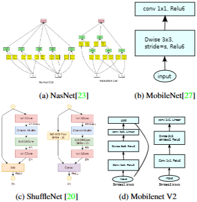
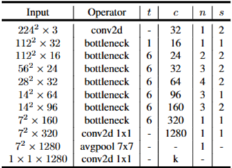

# 1. Paper Information

- Title: MobileNetV2: Inverted Residuals and Linear Bottlenecks
- Paper URL: [https://arxiv.org/pdf/1801.04381]

---

# 2. Motivation

## Problem
- 기존의 경량화 접근법(MobileNetV1)은 연산량을 줄이는 데 초점을 맞추었으나, 모델을 극단적으로 경량화할 때 낮은 차원에서의 활성화 함수(ReLU) 사용이 많은 정보 손실을 발생시킴
- 단순히 연산량을 줄이는 것만으로는 깊은 신경망이 가진 표현력(Representational Power)을 충분히 활용하지 못함

## Goal
- 단순한 연산량 절감을 넘어, 네트워크 내부의 정보 흐름을 수학적으로 해석하여 정보 손실을 최소화하는 구조를 설계
- 효율적인 메모리 사용(Memory footprint)을 위해, 추론 과정에서 중간 텐서를 모두 메모리에 올리지 않고도 동작할 수 있는 최적화된 아키텍처를 구축함.

---

# 3. Core Idea

- Inverted Residuals : 기존 잔차 연결(Residual Connection)과 달리, 채널 수가 적은 병목(Bottleneck) 계층 간을 연결하여 정보 흐름을 개선하고 메모리 효율성을 극대화함
- Linear Bottlenecks : 신경망의 비선형성(ReLU)이 낮은 차원의 공간에서 정보를 손실시키는 문제를 해결하기 위해, 병목 계층의 출력에 비선형 활성화 함수를 제거하고 선형 변환(Linear Convolution)을 적용함
- Memory-Efficient Inference : 인버티드 잔차 구조를 통해 추론 시 큰 중간 텐서를 메모리에 완전히 올리지 않아도 계산이 가능하도록 최적화함
- Depthwise Separable Convolutions : 공간 필터링(Depthwise)과 채널 간 선형 결합(Pointwise)으로 분리하여 기존 표준 합성곱 대비 연산 비용을 $8 \sim 9$배가량 절감함

---

# 4. Model Architecture & Forward Process

## Overall Architecture

- 
- 

---

## Components

### Inverted Residual Block (Bottleneck Block)
**Purpose**
- 정보 손실을 최소화하는 선형 병목(Linear Bottleneck) 구조와 효율적인 그래디언트 전파를 위한 인버티드 잔차 연결을 결합

**Configuration**
- **Expansion (1×1 Conv)**: 낮은 차원의 입력 채널을 더 높은 차원으로 확장 (Expansion Factor $t$ 적용)
- **Depthwise Conv (3×3)**: 확장된 채널에서 공간적 특징 추출
- **Pointwise Conv (1×1)**: 다시 낮은 차원의 출력 공간으로 투영 (이 단계에서는 비선형 활성화 함수를 제거하여 정보 손실 방지)

**Role**
- 좁은 병목 계층 간에 잔차 연결을 수행하여 메모리 효율성을 극대화하고, 내부의 고차원 확장으로 풍부한 특징 표현력 확보

**Output**
- (B, $C_{out}$, $H/s$, $W/s$)

### Width Multiplier ($\alpha$)
**Purpose**
- 네트워크의 모든 계층(마지막 계층 제외)에서 채널 수를 균일하게 조정하여 성능과 비용의 최적점 선택

**Output**
- (B, $\alpha \cdot C$, H, W)

### Resolution Multiplier ($\rho$)
**Purpose**
- 입력 해상도를 조정하여 연산량($\rho^2$에 비례)을 제어

**Output**
- (B, C, $\rho \cdot H$, $\rho \cdot W$)

---

## Forward Process

### 1. Input
(B, 3, $224\rho$, $224\rho$)

### 2. Stem Layer
(B, 3, $224\rho$, $224\rho$)  
↓ Conv3×3 (stride 2) + BN + ReLU6  
(B, 32$\alpha$, $112\rho$, $112\rho$)

### 3. MobileNetV2 Bottleneck Blocks
반복되는 19개의 Residual Bottleneck 계층을 거침  
↓ Bottleneck Block (t=1, c=16, s=1)  
↓ Bottleneck Block (t=6, c=24, s=2) $\times 2$  
↓ Bottleneck Block (t=6, c=32, s=2) $\times 3$  
↓ Bottleneck Block (t=6, c=64, s=2) $\times 4$  
↓ Bottleneck Block (t=6, c=96, s=1) $\times 3$  
↓ Bottleneck Block (t=6, c=160, s=2) $\times 3$  
↓ Bottleneck Block (t=6, c=320, s=1)  

### 4. Convolutional Tail
(B, 320$\alpha$, $7\rho$, $7\rho$)  
↓ Conv1×1 + BN + ReLU6  
(B, 1280$\alpha$, $7\rho$, $7\rho$)

### 5. Global Average Pooling
↓ GAP  
(B, 1280$\alpha$, 1, 1)

### 6. Classification Head
↓ FC(1000)  
(B, 1000)  
↓ Softmax  
(B, 1000)

- 논문에서는 1x1 conv 사용
    - GAP 이후 1x1 Conv는 FC와 똑같음

# 5. Mathematical Explanation

---

# 6. Training Configuration

| Item | Value |
|------|-------|
| Input Size | 224 × 224 |
| Optimizer | RMSprop |
| Decay Rate | 0.98 per epoch |
| Momentum | 0.9 |
| Weight Decay | 0.00004 |
| Batch Size | 96 |
| Activation | ReLU6 |

## Notes
- **Optimizer**: TensorFlow의 RMSprop을 사용하며, decay와 momentum은 모두 0.9로 설정함.
- **Learning Rate**: 초기 학습률은 0.045로 시작하며, 매 에폭(epoch)마다 0.98씩 감소시키는 지수적 감쇠(exponential decay)를 적용함.
- **Normalization**: 모든 계층 뒤에 배치 정규화(Batch Normalization)를 필수로 적용함.
- **Regularization**: MobileNetV2는 경량 모델의 특성상 과적합(overfitting)에 강한 면이 있으나, 표준적인 가중치 감쇠(weight decay)는 0.00004로 설정하여 학습의 안정성을 유지함.
- **Dropout**: 구체적인 수치는 명시되어 있지 않음.

## Data Preprocessing
| Item | Description |
|------|-------------|
| Augmentation | 표준적인 이미지 증강 기법을 사용하되, 모델의 크기에 최적화된 왜곡 정도를 적용 |
| Normalization | 모든 계층에 배치 정규화(Batch Normalization)를 적용하여 입력 분포의 안정화 |

# 7. Implementation

## Directory Structure

MobileNetV2/
├── README.md
├── model.py
└── main.py

## Model Implementation

- MobileNetV2의 핵심 구조인 **Inverted Residual Block**을 `InvertedBottleneck` 클래스로 구현
    - 1×1 Expansion Convolution
    - 3×3 Depthwise Convolution (`groups=in_channels`)
    - 1×1 Linear Projection
- Activation Function은 논문과 동일하게 `ReLU6`를 사용
- Skip Connection은 **Stride = 1**이고 **입·출력 채널 수가 동일한 경우에만** 적용하도록 구현
- 논문의 Block Configuration (`t`, `c`, `n`, `s`)을 `config` 리스트로 정의하고, 반복문을 이용하여 각 Stage를 자동 생성하도록 구현
- 모든 Stage를 `nn.Sequential`인 `features`에 저장하여 Forward 과정을 단순화
- 마지막 Feature Map은 `1×1 Convolution + Batch Normalization + ReLU6`를 통해 1280채널로 확장한 후 Global Average Pooling을 적용
- Classifier는 `Dropout(0.2)`와 Fully Connected Layer로 구성
- Width Multiplier(α)는 논문과 동일하게 마지막 `Classifier`를 제외한 층에 모두 `alpha`를 적용
- Resolution Multiplier(ρ)는 본 구현에서는 제외함
- Weight Initialization은 He(Kaiming) Normal Initialization(`fan_out`)을 적용하였으며, Bias는 0으로 초기화

## Verification

| Item | Result |
|------|--------|
| Input Shape | [2, 3, 224, 224] |
| Output Shape | [2, 1000] |
| Total Parameters | 3,505,960 |

---

## Notes

- Total Parameters가 원문에서는 3.4M인데, 직접 구현해보니 3.5M임
- 실제 데이터셋을 사용하지 않았으며, 랜덤 입력을 이용하여 모델 구조를 검증

---

# 8. Analysis

## merits

- **효율적인 정보 보존 (Linear Bottlenecks)**
    - 낮은 차원의 병목 계층에서 비선형성(ReLU)을 제거함으로써 정보 손실을 방지하고, 고차원 확장을 통해 네트워크의 표현력을 극대화함.

- **메모리 최적화 (Inverted Residuals)**
    - 인버티드 잔차 연결을 통해 추론 시 큰 중간 텐서를 메모리에 완전히 올리지 않아도 되는 구조를 구현하여, 메모리 점유율이 제한적인 임베디드 기기에서 매우 유리함.

- **유연한 하이퍼파라미터**
    - Width Multiplier($\alpha$)와 Resolution Multiplier($\rho$)를 통해 성능 요구사항과 하드웨어 제약에 맞춰 모델의 크기, 정확도, 지연 시간을 자유롭게 타겟팅 가능. 특히, 마지막 출력 계층을 유지함으로써 모델 크기를 줄여도 정확도 급락을 효과적으로 방어함.

## why?
- **왜 ReLU6을 사용했나?**
    - 출력 범위를 0~6으로 제한함으로써 양자화 시 발생하는 오차를 줄이고 저정밀도(int8) 연산에서도 안정적인 성능을 유지
    - 출력 범위를 제한함으로써 추가적인 비선형성이 생긴다?
        - 하지만 큰 값들을 모두 6으로 잘라서 오히려 기존 ReLU에 비해 표현력에는 제한이 생긴다

---

# 9. Personal Insights

- 저차원 공간에서는 ReLU가 더 큰 정보 손실을 발생시킬 수 있기 때문에 일부러 제거했다는 점이 기존 CNN들과 다른 접근 방식이었다.

---