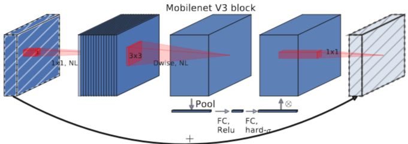
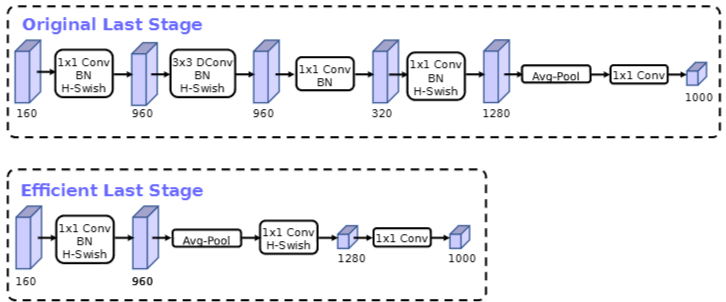
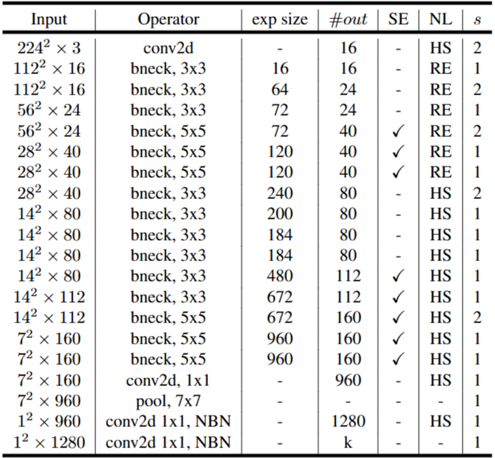
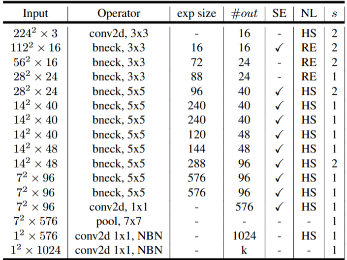
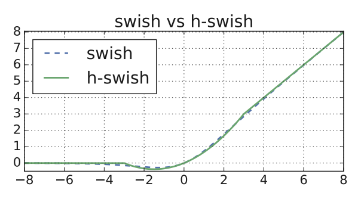
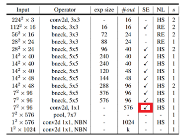

# 1. Paper Information

- Title: Searching for MobileNetV3
- Paper URL: [https://arxiv.org/pdf/1905.02244]

---

# 2. Motivation

## Problem
- 기존의 모델들은 하드웨어 특성을 충분히 고려하지 않은 채 연산량 감소에만 집중하여 실제 모바일 기기에서의 추론 지연 시간을 최적화하는 데 한계가 있음

## Goal
- 모바일 기기에서 정확도와 지연 시간의 최적 균형을 달성하는 차세대 아키텍처를 구축함

---

# 3. Core Idea

- NAS(Neural Architecture Search)를 통해 전체 네트워크 구조를 설계하고, NetAdapt 알고리즘을 사용하여 계층별 필터 수를 최적화함으로써 하드웨어 제약 조건을 충족함
- 기존의 $swish(x)$ 함수는 모바일 환경에서 시그모이드 연산 비용이 크므로, $h-swish[x] = x \cdot \frac{ReLU6(x + 3)}{6}$ 형태로 대체하여 정확도를 유지하면서 지연 시간을 대폭 감소시킴
- 네트워크 마지막의 연산 비용이 높은 계층을 재설계하여 효율성을 높이고, 세그멘테이션 작업에는 Lite Reduced Atrous Spatial Pyramid Pooling(LR-ASPP) 디코더를 제안하여 추론 속도를 개선함
- SE 블록의 압축 채널 수의 비율을 조정하는 Reduction ratio를 $1/4$로 고정하여 정확도 향상과 하드웨어 효율성을 동시에 달성함

---

# 4. Model Architecture & Forward Process

## Overall Architecture

### MobileNetV3-Large

### MobileNetV3-Small

---

## Components

### MobileNetV3 Block (Inverted Residual + SE)
**Purpose**
- 기존의 Inverted Residual Block에 Squeeze-and-Excitation(SE) 모듈을 결합하여, 채널 간 의존성을 학습하고 표현력을 강화함

**Configuration**
- **Expansion (1×1 Conv)**: 입력 채널을 확장함 (채널 수는 expansion size에 따름)
- **Depthwise Conv (3×3 or 5×5)**: 확장된 채널에서 공간적 특징 추출
- **Squeeze-and-Excitation**: 채널 중요도를 계산 (Reduction Ratio를 4로 고정)
- **Pointwise Conv (1×1)**: 낮은 차원의 출력 공간으로 투영 (이 단계에서는 활성화 함수 생략 또는 선형 변환 수행)

**Role**
- 좁은 병목 계층 간에 잔차 연결을 수행하여 메모리 효율을 극대화하고, 내부의 고차원 특징을 통해 복잡한 정보 추출

**Output**
- (B, $C_{out}$, $H/s$, $W/s$)

### Width Multiplier ($\alpha$)
**Purpose**
- 전체 네트워크의 채널 너비를 균일하게 조정하여, 주어진 하드웨어 자원에 맞춰 모델의 크기와 연산량을 유연하게 조절

### Resolution Multiplier ($\rho$)
**Purpose**
- 입력 해상도를 조정하여 지연 시간(Latency)과 정확도 간의 타협점을 정밀하게 설정

---

## Forward Process

### 1. Input
(B, 3, $224\rho$, $224\rho$)

### 2. Stem Layer
(B, 3, $224\rho$, $224\rho$)  
↓ Conv3×3 (stride 2) + BN + h-swish  
(B, 16$\alpha$, $112\rho$, $112\rho$)

### 3. MobileNetV3 Bottleneck Blocks
다양한 커널 크기(3x3, 5x5)와 활성화 함수(ReLU, h-swish)가 적용된 블록들을 순차적으로 통과함  
(설계된 NAS 아키텍처에 따라 블록별 stride 및 필터 수 적용)

### 4. Efficient Last Stage (Convolutional Tail)
MobileNetV3는 마지막 연산을 최적화하여 이전 모델보다 더 빠르게 특징을 추출함  
↓ Conv1×1 + BN + h-swish (Feature Expansion)  
↓ Global Average Pooling (GAP)  
↓ Conv1×1  
(B, 960$\alpha$, 1, 1)  
↓ Conv1×1 (최종 출력층)  
(B, 1280$\alpha$, 1, 1)

### 5. Classification
↓ FC(1000) 또는 Conv1×1 적용  
(B, 1000)  
↓ Softmax  
(B, 1000)

*   **참고**: MobileNetV3에서는 MobileNetV2와는 다르게 마지막 stage에서 Bottleneck Block(Depthwise Conv와 Projection)을 없애고 1x1 Conv를 GAP 뒤로 이동시켜 연산 비용을 절약하고 속도를 향상시킴

# 5. Mathematical Explanation (New Ideas)

## 1. h-swish Approximation (Hard Swish)
기존 $swish$ 함수의 비선형성으로 인한 모바일 연산 비용(특히 시그모이드 함수의 지수 연산)을 하드웨어 친화적인 조각별 선형 함수(piece-wise linear)로 근사.

- 

- **기존 swish**: 
  $$f(x) = x \cdot \sigma(x) = x \cdot \frac{1}{1 + e^{-x}}$$
- **h-swish 근사**: 
  $$h\text{-}swish[x] = x \cdot \frac{ReLU6(x + 3)}{6}$$
  - **수학적 근거**: $\sigma(x)$의 0~1 사이 값을 $\frac{ReLU6(x+3)}{6}$ (범위 $[0, 1]$)로 선형 근사하여, 복잡한 $e^{-x}$ 계산을 제거하고 모바일 CPU의 상수 연산 및 Clipping 연산만으로 대체함. 
  - **이점**: 고정 소수점(Fixed-point) 연산에서 정밀도 손실 없이 동일한 비선형 특성을 확보함.

---

# 6. Training Configuration

| Item | Value |
|------|-------|
| Input Size | 224 × 224 |
| Optimizer | RMSProp |
| Momentum | 0.9 |
| Weight Decay | 1e-5 |
| Batch Size | 4096 |
| Learning Rate | Initial 0.1 |
| EMA | 0.9999 |

## Notes
- **Hardware/Setup**: 4x4 TPU Pod를 이용한 동기식(synchronous) 학습 환경
- **Optimizer**: TensorFlow의 standard RMSPropOptimizer를 사용함
- **Learning Rate**: 초기 학습률 0.1에서 시작하여, 3 에폭(epoch)마다 0.01을 곱함
- **Normalization**: 모든 컨볼루션 계층에 배치 정규화(Batch Normalization)를 적용하며, 평균 감쇠율(decay)은 0.99를 사용함
- **Regularization**: 0.8의 드롭아웃(dropout)과 1e-5의 L2 가중치 감쇠(weight decay)를 사용함
    - Batch Size를 키워서 학습 속도가 빨라졌지만 과적합 위험이 생겨서 dropout 수치를 크게 줌으로써 일반화 능력을 향상시킴
    - Large-batch training에서 많이 쓰는 방법
- **EMA**: 학습 완료 후 추론 성능 향상을 위해 가중치에 대해 0.9999의 decay 적용

## Data Preprocessing
| Item | Description |
|------|-------------|
| Preprocessing | Inception 스타일의 표준 이미지 전처리 기법(이미지 크기 조절 및 정규화) 적용 |
| Augmentation | 모델의 학습 효율과 일반화 성능을 높이기 위한 표준 증강 기법 포함 |

# 7. Implementation

## Directory Structure

MobileNetV3/
├── README.md
├── model.py
└── main.py

## Model Implementation

- MobileNetV3 Small Architecture를 PyTorch로 Scratch 구현
- Batch Normalization은 논문의 구현과 동일하게 `momentum=0.99`를 사용
- Width/Resolution Multiplier는 구현하지 않았음
- Weight Initialization
    - Convolution Layer : Kaiming Normal Initialization (`fan_out`)
    - Linear Layer : Normal Distribution (mean=0, std=0.01)
    - Bias : 0으로 초기화

## Verification

| Item | Result |
|------|--------|
| Input Shape | [2, 3, 224, 224] |
| Output Shape | [2, 1000] |
| Total Parameters | 2,537,238 |

## Notes

Table 2에서는 Conv Tail 이후 SE Block이 표시되어 있으나, 공개 구현 및 파라미터 수를 보니 없는게 맞는 것 같다.

---

# 8. Analysis

## Merits

- **효율적인 정보 보존 (Linear Bottlenecks)**
    - 좁은 병목 계층에서 비선형성을 제거하여 정보 손실을 방지하고, 고차원 확장을 통해 네트워크의 표현력을 최적화함.

- **메모리 최적화 (Inverted Residuals)**
    - 인버티드 잔차 연결을 통해 추론 시 메모리 점유율을 최소화하여, 메모리 대역폭이 제한된 모바일 환경에서 유리한 구조를 제공함.

- **유연한 하이퍼파라미터**
    - Width/Resolution Multiplier를 통해 하드웨어 제약에 맞춰 모델 크기와 지연 시간을 자유롭게 조절함.

- **하드웨어 친화적 설계 (h-swish & SE)**
    - 지수 연산이 포함된 $swish$를 하드웨어에서 매우 빠른 `h-swish`로 대체하고, SE 모듈의 병목 크기를 고정하여 하드웨어 가속기에서의 지연 시간을 최적화함.

# 9. Personal Insights

- 하드웨어 친화적 설계: 단순히 연산량을 줄이는 것을 넘어, 실제 CPU/NPU가 처리하기 가장 쉬운 구조(h-swish, 고정된 SE 비율 등)를 찾아내는 것이 속도 향상의 핵심임

- 구조적 타협과 보완: 하드웨어 효율을 위해 일부 수학적 정교함(예: 시그모이드, 병목부 ReLU 제거)을 포기하는 대신, 채널 확장이나 연산 순서 재배치로 성능 저하를 막음

---