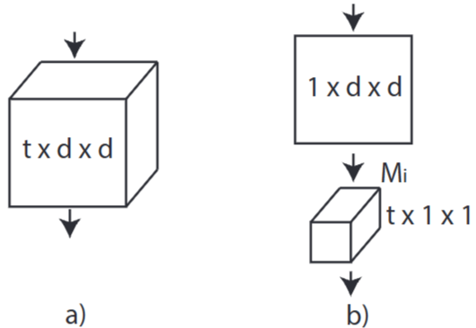
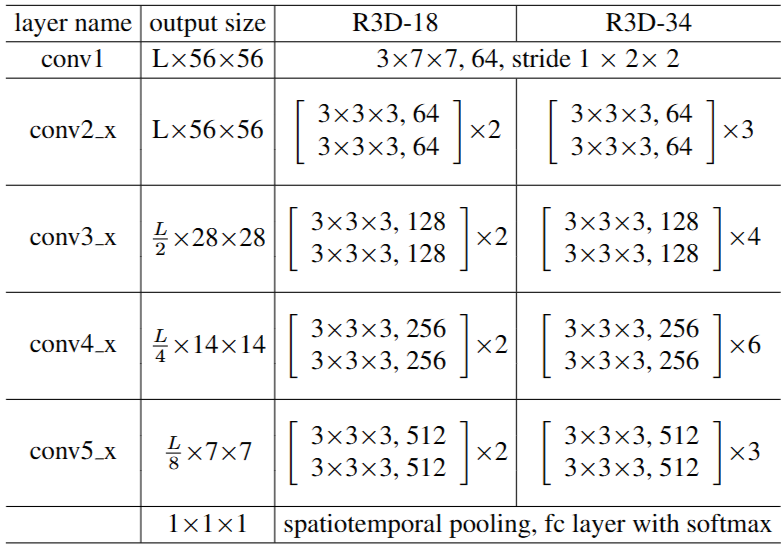

# 1. Paper Information

- Title: A Closer Look at Spatiotemporal Convolutions for Action Recognition
- Paper URL: [https://arxiv.org/pdf/1711.11248]

---

# 2. Motivation

- 저자들은 기존의 2D CNN이 정적 프레임 분석에는 뛰어나지만 비디오의 동적 특성을 모델링하는 데 한계가 있음
  - R2D(2D ResNet) 모델의 경우, 비디오의 $L$개 프레임을 입력으로 받을 때 이를 단순히 채널 차원으로 합쳐버림 즉, $3 \times L \times H \times W$ 형태의 4D 텐서를 $3L \times H \times W$ 형태의 3D 텐서로 재구성하여 처리해서 첫 번째 컨볼루션 레이어에서 시간적 순서가 의미를 잃게 되며, 이후 레이어에서는 동작 패턴을 추론할 수 없게 됨
  - f-R2D와 같은 방식은 개별 프레임을 각각 독립적으로 처리함, 이는 각 프레임의 정적인 특징(Appearance)은 잘 잡아내지만, 프레임 사이의 변화나 연속적인 움직임(Dynamics)을 연결하는 구조적 장치가 없어서 "무엇이 있는가"는 알 수 있지만, "어떻게 움직이는가"에 대한 정보는 컨볼루션 레이어를 거친 후 최고 단계의 pooling 레이어에서 단순히 합산될 뿐임
  - 2D 필터는 공간적(Height, Width) 패턴을 인식하도록 설계되어 있음, 비디오의 동적 특성을 파악하려면 시간축에 걸친 변화를 감지해야 하는데, 2D 필터는 공간 차원 내에서만 가중치를 공유하기 때문에 연속된 프레임 사이의 시간적 상관관계(Correlation)를 직접적으로 계산하지 못함

## Core Idea

- 3D convolution을 2D 공간 필터와 1D 시간 필터로 분해함으로써 비선형성을 높이고 최적화를 용이하게 함
  - N x 1 x d x d 필터 합성곱 -> ReLU -> M x t x 1 x 1 필터 합성곱
    - N : 채널 수 
    - M : 공간축 합성곱 후 채널 수
  - 2D 공간 필터와 1D 시간 필터 사이에 ReLU 비선형 활성화 함수가 추가되서 동일한 파라미터 수 대비 비선형성을 두 배로 증가시켜 모델의 표현력이 강화됨
  - 왜 최적화가 용이해짐?
    - 3D 합성곱에서는 하나의 필터가 동시에 공간적 패턴과 시간적 변화 두 가지를 동시에 학습하지만, 공간 필터와 시간 필터로 나누면 두 가지 필터가 각각 한 가지씩만 학습하면 되서 최적화가 더 쉬워짐

---

# 3. Model Architecture & Forward Process

## Overall Architecture
- 3D convolution vs (2+1)D

## Components

### Spatiotemporal Convolutional Block (R(2+1)D)

**Purpose**
- 3D 컨볼루션 필터를 공간과 시간 차원으로 분해하여, 연산 효율성을 높이고 비선형성을 극대화하여 표현력을 향상시킵니다.

**Configuration**
- **Spatial Convolution ($2D$)**: 입력 텐서의 공간적 차원($H \times W$)에 대해 커널 크기($d \times d$)를 적용하여 외형(Appearance) 정보를 추출합니다.
- **Temporal Convolution ($1D$)**: 공간 연산 이후 결과값에 대해 시간 차원($t$)으로 커널 크기를 적용하여 동적(Dynamics) 패턴을 추출합니다.
- **Factorization**: Mi(중간 채널 수)를 조절하여 전체 파라미터 수를 3D 컨볼루션과 동일하게 맞추되, 중간에 비선형 활성화 함수(ReLU)를 추가하여 모델의 깊이를 가상으로 확장합니다.

**Role**
- 공간과 시간의 모델링을 독립적인 단계로 분리하여, 네트워크가 보다 복잡한 함수를 표현할 수 있도록 유도하고 최적화가 용이한 환경을 제공합니다.

**Output**
- 시간과 공간 정보를 성공적으로 결합한 특징 맵을 출력하며, Residual Connection을 통해 초기 단계의 정보가 소실되지 않도록 보존합니다.

---

## Forward Process

### 1. Initial Projection (conv1)
입력 비디오를 다차원 텐서로 투영하여 특징 추출을 시작
- **Input**: $(B, 3, L, H, W)$
- **Output (conv1)**: $(B, N_1, L, H_1, W_1)$
  - 예: $L \times 112 \times 112$ 입력 시 $\rightarrow$ $(B, 64, L, 56, 56)$

### 2. Spatiotemporal Residual Stages
각 스테이지 전환 시 공간-시간 스트라이드(Stride)를 통해 해상도를 줄이고 채널 차원을 확장

| Stage | 해상도 (Time $\times$ Height $\times$ Width) | 채널 차원 ($N_i$) | 연산 방식 |
| :--- | :--- | :--- | :--- |
| **conv1** | $L \times 56 \times 56$ | 64 | 2D + 1D Conv |
| **conv2** | $L \times 56 \times 56$ | 64 | 2D + 1D Conv |
| **conv3** | $L/2 \times 28 \times 28$ | 128 | 2D + 1D Conv (w/ Stride) |
| **conv4** | $L/4 \times 14 \times 14$ | 256 | 2D + 1D Conv (w/ Stride) |
| **conv5** | $L/8 \times 7 \times 7$ | 512 | 2D + 1D Conv (w/ Stride) |

*   각 단계 전환 시 spatiotemporal downsampling(Stride 2x2x2)을 통해 해상도가 감소하고, 채널 차원은 2배씩 증가하여 연산 복잡도를 균형 있게 배분함.

### 3. Classification Head (Global Spatiotemporal Pooling)
최종 단계의 특징 텐서 전체를 평균화하여 고정된 크기의 벡터를 생성 후 예측 수행

$$
(B, N_{final}, L_{final}, H_{final}, W_{final}) \rightarrow (B, D) \rightarrow (B, K)
$$

- $K$: 클래스 개수 (예: Kinetics 400)
- R(2+1)D 기준 최종 특징 벡터는 $(B, 512)$의 형태를 가집니다.

# 4. Implementation

## Directory Structure

R(2+1)D/
├── README.md
├── 
└── 

## Model Implementation

## Verification

| Item | 구현 방식 |
| :--- | :--- |
| Input Shape |  |
| Output Shape |  |
| Total Parameters |  |
| FLOPs |  |

---

# 5. Analysis & Insights

## Why?

- **왜 Sports-1M보다 Kinetics 사전학습이 더 효과적​일까?**
  - Sports-1M은 스포츠 중심의 평균 길이가 5분 이상인 영상으로 라벨 외에도 다른 동작들이 많이 나타남
  - Kinetics는 사람의 동작을 인식하기 위해 동작 중심으로 구성된 약 10초 길이의 클립으로 만든 데이터셋
    - 핵심 동작 클립만 딱 잘라만든 Kinetics가 학습에 훨씬 적합함

---