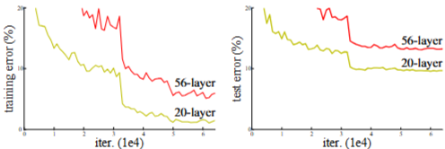
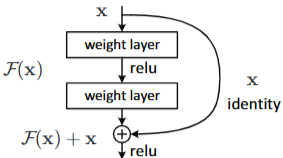
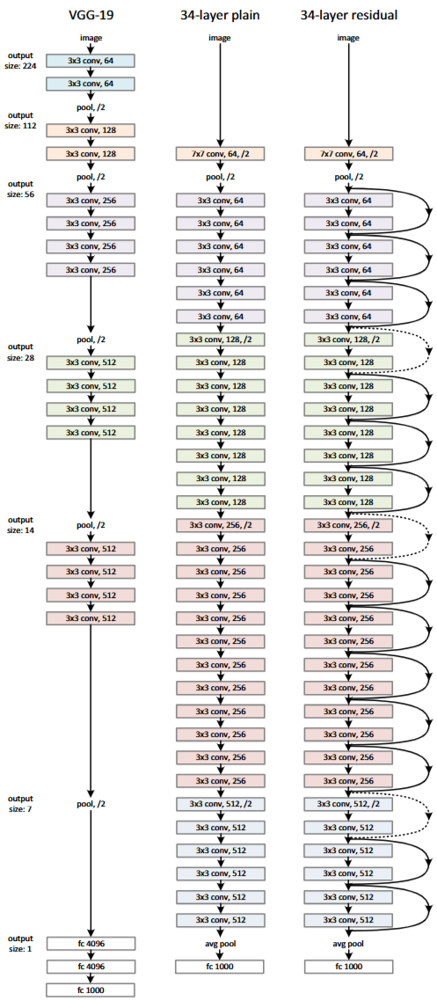
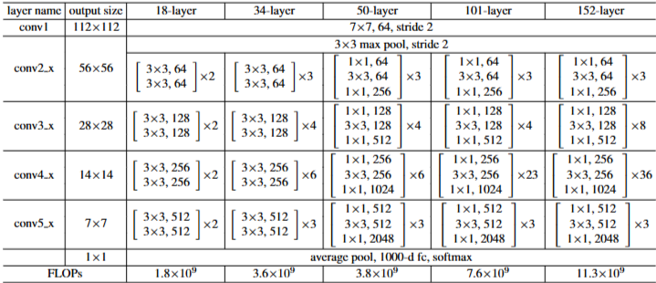

# 1. Paper Information

- Title: VERY DEEP CONVOLUTIONAL NETWORKS FOR LARGE-SCALE IMAGE RECOGNITION
- Paper URL: [https://arxiv.org/pdf/1409.1556]

---

# 2. Motivation

<!--
왜 이 논문이 등장했는가?
기존 연구의 문제점은 무엇이었는가?
이 논문이 해결하려는 문제는 무엇인가?
예를 들어
- Accuracy가 부족했다.
- 학습이 어려웠다.
- 계산량이 너무 컸다.
- 데이터가 부족했다.
-->

## Problem
- 이전의 연구 결과들을 보면 신경망의 깊이는 고수준 features를 추출하는데 매우 중요하지만 두 가지 문제가 있음
    1. vanishing/exploding gradients 문제
        - 정규화 기법들로 크게 해결
    2. degradation problem: 일정 수준 이상 깊어지면 얕은 모델보다 깊은 모델이 오히려 더 높은 training error가 발생
        - 
        - Overfitting 아님

## Goal
- degradation problem을 해결해 깊은 신경망의 학습을 안정적으로 성공시킨다.

---

# 3. Core Idea

<!--
논문의 핵심 아이디어를
3~5줄 정도로 요약
"이 논문의 가장 중요한 기여가 무엇인가?"
를 적는다.
-->

- 목표값(H(x))을 학습하는 대신 입력과 출력의 차이인 잔차(F(x) = H(x) - x)를 학습하도록 재구성함
- 입력값을 출력층으로 바로 전달하는 Shortcut Connection을 도입하여, 추가적인 파라미터나 연산 비용 없이도 매우 깊은 신경망까지 안정적인 학습

---

# 4. Model Architecture & Forward Process

## Overall Architecture

---

## Components

### Conv7-64

**Purpose** 
- 입력 이미지의 저수준 특징(Edge, Texture 등)을 추출

**Configuration** 
- Kernel Size : 7×7 
- Stride : 2 
- Padding : 3 
- Activation : ReLU 
- Normalization : Batch Normalization

**Role** 
- 입력 이미지의 초기 특징을 빠르게 추출 
- Stride=2를 사용하여 Feature Map의 해상도를 절반으로 감소

**Output** 
- (B, 3, H, W) → (B, 64, H/2, W/2)

### MaxPool

**Purpose** 
- Feature Map의 해상도를 감소시켜 연산량과 메모리 사용량을 줄임

**Configuration** 
- Kernel Size : 3×3 
- Stride : 2 
- Padding : 1

**Role** 
- 중요한 특징을 유지하면서 Feature Map의 크기를 절반으로 감소 
- Receptive Field를 증가시킴

**Output** 
- (B, C, H, W) → (B, C, H/2, W/2)

### Basic Residual Block

**Purpose** 
- 입력 Feature를 직접 학습하지 않고 Residual(잔차)을 학습하여 깊은 네트워크의 학습을 안정화

**Configuration** 
- Conv3×3 
- Batch Normalization 
- ReLU 
- Conv3×3 
- Batch Normalization 
- Shortcut Connection 
- ReLU

**Role** 
- 입력 Feature를 Shortcut으로 전달하여 Gradient Vanishing 문제를 완화 
- Residual Learning을 통해 깊은 네트워크의 최적화를 쉽게 수행

**Output** 
- (B, C, H, W) → (B, C, H, W)

### Projection Shortcut

**Purpose** 
- Feature Map의 크기 또는 Channel 수가 변경될 때 Shortcut과 Main Branch의 크기를 맞춤

**Configuration** 
- Conv1×1 
- Stride : 2 (Downsampling 시)

**Role** 
- Shortcut의 Shape을 Main Branch와 동일하게 변환 
- Downsampling이 필요한 Residual Block에서 사용

**Output** 
- (B, C, H, W) → (B, out_c, H/2, W/2)

### Global Average Pooling

**Purpose** 
- Feature Map의 공간 정보를 평균하여 하나의 Feature Vector로 변환

**Configuration** 
- Kernel Size : Feature Map 전체

**Role** 
- Fully Connected Layer의 Parameter 수를 크게 감소 
- 위치 정보보다 채널별 특징을 요약

**Output** 
- (B, 512, 7, 7) 
  ↓ Global Average Pooling 
- (B, 512)

### FC Layer

**Purpose** 
- 최종 Feature Vector를 이용하여 각 클래스의 Logit을 계산

**Configuration** 
- Input : 512 
- Output : 1000 (ImageNet Classes)

**Role** 
- 각 클래스에 대한 Logit 생성

**Output** 
- (B, 512) 
  ↓ FC 
- (B, 1000)

### Softmax

**Purpose** 
- FC Layer에서 출력된 Logits를 확률 분포로 변환

**Role** 
- 각 클래스의 예측 확률 계산 
- 확률의 총합은 1이 되며, 가장 높은 확률을 가진 클래스를 최종 예측으로 선택

---

## Forward Process

### 1. Input

(B, 3, 224, 224)

### 2. Conv7×7-64

(B, 3, 224, 224) 
↓ Conv7×7 + BN + ReLU 
(B, 64, 112, 112)

### 3. MaxPool

(B, 64, 112, 112) 
↓ MaxPool 
(B, 64, 56, 56)

### 4. Layer1 (3 Residual Blocks)

(B, 64, 56, 56) 
↓ Basic Block ×3 
(B, 64, 56, 56)

### 5. Layer2 (4 Residual Blocks)

(B, 64, 56, 56) 
↓ Projection Shortcut + Basic Block 
(B, 128, 28, 28) 
↓ Basic Block ×3 
(B, 128, 28, 28)

### 6. Layer3 (6 Residual Blocks)

(B, 128, 28, 28) 
↓ Projection Shortcut + Basic Block 
(B, 256, 14, 14) 
↓ Basic Block ×5 
(B, 256, 14, 14)

### 7. Layer4 (3 Residual Blocks)

(B, 256, 14, 14) 
↓ Projection Shortcut + Basic Block 
(B, 512, 7, 7) 
↓ Basic Block ×2 
(B, 512, 7, 7)

### 8. Global Average Pooling

(B, 512, 7, 7) 
↓ Global Average Pooling 
(B, 512)

### 9. FC-1000

(B, 512) 
↓ FC 
(B, 1000)

### 10. Softmax

(B, 1000) 
↓ Softmax 
(B, 1000)

---

# 5. Mathematical Explanation

<!--
논문의 수식을 하나씩 설명

단순히 수식을 적지 말고

왜 사용하는지

각 기호의 의미

직관적인 의미

Gradient는 어떻게 흐르는지

예시

L = CrossEntropy(...)

↓

왜 Cross Entropy를 사용하는가?

↓

수식이 의미하는 것은?
-->

- H(x) = F(x) + x
    - x: 입력값
    - F(x): xW(학습 파라미터)
    - H(x): 원하는 최종 출력값
        - **F(x)는 입력 x에 대해 원하는 출력값(H(x))를 만들기 위해 얼마나 더해주거나 빼주어야 하는가(residual)를 학습하게 된다**
            - F(x) = H(x) - x

---

# 6. Training Configuration

| Item | Value |
|------|-------|
| Augmentation | Random Cropping(224*224), Horizontal Flipping, Color Augmentation |
| Input Size | 224 × 224 |
| Optimizer | mini-batch SGD |
| Batch Size | 256 |
| Initial LR | 0.1 |
| Momentum | 0.9 |
| Weight Decay | 1e-4 |
| Dropout | 0 |
| Loss | Cross Entropy |
| Initial weight | He Initialization |
| Initial bias | He Initialization |

- Validation Accuracy가 더 이상 개선되지 않을 때 LR을 1/10으로 줄임

## Data Preprocessing

- Resize (shorter side ∈ [256, 480])
- Per-pixel Mean Subtraction: 전체 데이터셋의 각 픽셀 위치별 평균값을 이미지에서 빼주어 데이터가 0을 중심으로 분포하게 하여 편향을 제거해줌으로써 최적화 과정이 원활해짐

## Evaluation Strategy

### 10-Crop Testing

- 입력 이미지의 네 모서리와 중심에서 224×224 크기로 Crop하여 5개의 이미지를 생성
- 각 Crop을 수평 뒤집기(Horizontal Flip)하여 추가로 5개의 이미지를 생성
- 총 10개의 이미지에 대해 각각 예측을 수행
- 10개의 예측 결과를 평균하여 최종 분류 결과를 생성

### Fully Convolutional Inference & Multi-scale Averaging

- Fully Connected Layer를 Convolution Layer로 변환하여 다양한 입력 크기를 처리
- 입력 이미지를 여러 Scale(224, 256, 384, 480, 640)로 Resize하여 각각 추론 수행
- 각 Scale에서 얻은 Prediction Score를 평균하여 최종 결과를 생성

---

# 7. Implementation

<!--
논문를 Scratch로 구현한 내용을 작성합니다.

- 구현한 파일 구조
- 구현 과정
- 논문과 다르게 구현한 부분
- Random Input으로 Forward Pass 검증
- Tensor Shape 검증
- Parameter 개수 확인

코드 자체보다는 구현 과정과 검증 내용을 중심으로 작성합니다.
-->

## Directory Structure

VGGNet/
├── README.md
├── model.py
└── train.py

## Model Implementation

- extract_features와 classifier를 각각 `nn.Sequential`로 구현
    - extract_features: 13-Convolution Layer
    - classifier: 3-Fully Connected Layer
- 본 구현에서는 `nn.AdaptiveAvgPool2d(7, 7)`를 추가해 입력 크기와 관계없이 마지막 Feature Map의 크기를 7×7로 맞춘 후 Fully Connected Layer를 적용하도록 구현함
- Weight Initialization은 논문과 동일하게 Gaussian Distribution N(0,0.01) 적용함

## Verification

| Item | Result |
|------|--------|
| Input Shape | [2, 3, 224, 224] |
| Output Shape | [2, 1000] |
| extract_features params | 14,714,688 |
| classifier params | 123,642,856 |
| Total params | 138,357,544 |

## Notes

- VGGNet16(Configuration D) 구조를 PyTorch로 Scratch 구현
- 실제 데이터셋을 사용하지 않았으며, 랜덤값을 입력으로 사용
- 검증
    - Input/Output Shape
    - Forward pass
    - Total param: 138M으로 원 논문과 동일

---

# 8. Analysis

<!--
논문를 객관적으로 분석합니다.

- 장점
- 단점
- 왜 이러한 구조가 효과적인가?
- 어떤 상황에서 잘 동작하는가?
- 어떤 상황에서는 한계가 있는가?
- 후속 연구에서는 어떻게 개선되었는가?

논문를 비판적으로 분석하는 공간입니다.
-->

## merits
- 추가 파라미터나 연산 비용이 발생하지 않는다.
- 매우 깊은 신경망까지 안정적으로 학습해 성능 향상을 가능하게 한다.
- 구현이 무척 쉽다.

## demerits

## why
- H(x) = F(x) + x가 왜 최적화하기 더 쉬울까?
    - H(x) = 3.3, x = 3.0, F(x) = xW 이라고 할 때
        - 기존 H(x) = F(x)로 구하려면
            - xW = 3.3
            - W = 1.1
        - H(x) = F(x) + x로 구하면
            - xW + x = 3.3
            - W = 0.1
    - **W는 애초에 0 근처로 초기화하기 때문에 1.1보다 0.1을 학습하는게 훨씬 쉽다**

---

# 9. Personal Insights

<!--
내가 논문를 읽고 느낀 점

새롭게 알게 된 점

인상 깊었던 부분

프로젝트에 적용할 수 있는 아이디어

다음에 공부할 내용

등을 자유롭게 작성
-->

- 논문과 최신 구현 방법 사이에 차이가 있다는 점이 흥미로웠다. 특히 `nn.AdaptiveAvgPool2d((7, 7))`를 사용하는 이유를 이해할 수 있었고, 이를 통해 다양한 입력 크기를 처리할 수 있다는 점을 배웠다.
- VGG16의 전체 파라미터(약 138M) 중 대부분이 Fully Connected Layer에 집중되어 있다는 점이 인상적이었다. 이후 ResNet이나 EfficientNet 등에서 Global Average Pooling을 사용하는 이유를 이해하는 데 도움이 되었다.
- 논문에서는 모든 가중치를 Gaussian Distribution N(0, 0.01)으로 초기화했지만, 최근에는 ReLU를 고려한 He Initialization(분산이 2배)이 더 널리 사용된다는 점을 비교하며 이해할 수 있었다.

---