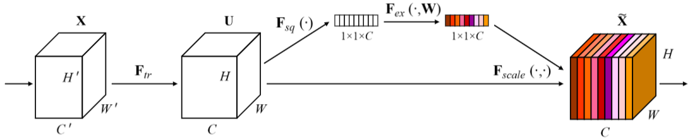
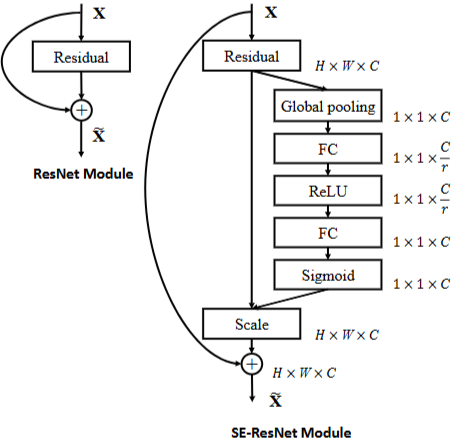
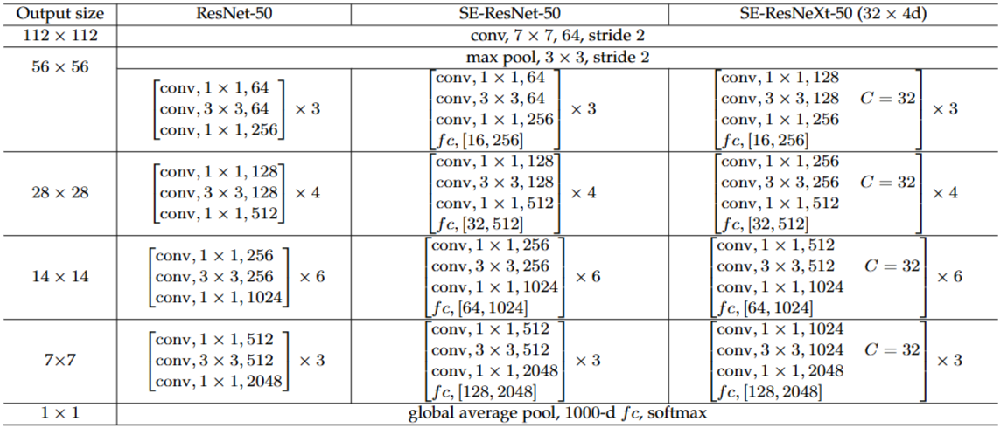

# 1. Paper Information

- Title: Squeeze-and-Excitation Networks
- Paper URL: [https://arxiv.org/pdf/1709.01507]

---

# 2. Motivation

## Problem

- CNN의 표현력을 높이기 위해 공간적인 인코딩을 강화하는 데 집중한 반면, 채널 간의 관계를 다루는 방식은 상대적으로 적었음.
- Convolution 연산은 공간 정보와 채널 정보를 동시에 융합하지만, 채널 간의 의존성은 필터의 로컬 수용 영역(Receptive Field) 내에서 얽힌 상태로 학습됨
    - 네트워크가 명시적으로 채널 간의 상관관계를 제어하거나 활용하기 어려운 구조
- 각 필터는 국소적인 정보만을 다루므로, 이미지 전체를 관통하는 전역적인 문맥을 반영하여 채널의 중요도를 동적으로 결정하는 능력이 부족함

## Goal

- 네트워크가 유익한 특징(informative features)은 강조하고, 덜 중요한 특징은 억제(suppress)할 수 있도록 학습시키는 것

---

# 3. Core Idea

- Squeeze(압축) : `Global Average Pooling`을 통해 각 채널의 공간적 값을 하나로 요약
    - 필터가 전체 수용 영역의 정보를 가짐
- Excitation : 압축된 정보를 기반으로 채널 간의 비선형적인 관계를 학습하는 `self-gating` 매커니즘 수행
    - 이 때 `bottleneck` 구조를 사용해서 파라미터 수를 줄임
- Recalibration(재보정) : 계산된 채널 가중치를 원래 특징 맵에 곱하여 정보의 흐름을 동적으로 제어

---

# 4. Model Architecture & Forward Process

## Overall Architecture

- 
- 
- 

---

## Components

### SE-ResNet Building Block
**Purpose**
- 컨볼루션 연산으로 추출된 특징 맵에서 채널 간 상호의존성을 명시적으로 모델링하여 유익한 특징을 재보정(Recalibration)

**Configuration**
- **기본 경로**: Residual Block (Conv1x1 - Conv3x3 - Conv1x1)
- **SE 경로**: Squeeze(Global Average Pooling) - Excitation(FC - ReLU - FC - Sigmoid) - Scale

**Role**
- 3x3 컨볼루션 이후의 특징 맵에 대해 채널별 중요도를 동적으로 할당하여, 유용한 정보는 강조하고 덜 중요한 정보는 억제함

**Output**
- (B, C_out, H, W)

### Squeeze Operation (Global Average Pooling)
**Purpose**
- 채널별 공간 정보를 하나의 스칼라 값으로 압축하여 전역적인 특징 통계 생성

**Role**
- 로컬 수용 영역의 한계를 넘어 전역적인 문맥(Global context)을 파악하기 위한 데이터 생성

**Output**
- (B, C, H, W) → (B, C, 1, 1)

### Excitation Operation (Gating Mechanism)
**Purpose**
- 압축된 채널 통계를 바탕으로 채널 간 비선형적 상호관계를 학습하여 가중치 생성

**Configuration**
- FC(Reduction Ratio $r=16$) - ReLU - FC - Sigmoid

**Role**
- 채널 간의 복잡한 의존성을 모델링하고, 각 채널에 적용할 $0$과 $1$ 사이의 스케일링 가중치를 산출

**Output**
- (B, C, 1, 1)

### Scale Operation
**Purpose**
- Excitation에서 얻은 가중치를 원래의 특징 맵에 곱하여 최종 출력을 생성

**Role**
- 특징 맵의 채널별 중요도(Attention)를 반영하여 정보의 흐름을 동적으로 제어

**Output**
- (B, C, H, W)

---

## Forward Process (SE-ResNet-50 기준)

### 1. Input
(B, 3, 224, 224)

### 2. Stem Layer
(B, 3, 224, 224)  
↓ Conv7×7 (stride 2) + BN + ReLU  
(B, 64, 112, 112)  
↓ MaxPool (3×3, stride 2)  
(B, 64, 56, 56)

### 3. Stage 1 (3 blocks)
(B, 64, 56, 56)  
↓ 3 × SE-ResNet Blocks  
(B, 256, 56, 56)

### 4. Stage 2 (4 blocks)
(B, 256, 56, 56)  
↓ 4 × SE-ResNet Blocks  
(B, 512, 28, 28)

### 5. Stage 3 (6 blocks)
(B, 512, 28, 28)  
↓ 6 × SE-ResNet Blocks  
(B, 1024, 14, 14)

### 6. Stage 4 (3 blocks)
(B, 1024, 14, 14)  
↓ 3 × SE-ResNet Blocks  
(B, 2048, 7, 7)

### 7. Global Average Pooling
(B, 2048, 7, 7)  
↓ GAP  
(B, 2048)

### 8. FC-1000 & Softmax
(B, 2048)  
↓ FC  
(B, 1000)  
↓ Softmax  
(B, 1000)

# 5. Mathematical Explanation

- SE 블록의 채널 재보정 연산 (Excitation)
    - 입력 특징 맵 $U \in \mathbb{R}^{H \times W \times C}$에 대해 채널별 가중치 $s \in \mathbb{R}^C$를 생성하여 곱하는 과정

    $$s = F_{ex}(z, W) = \sigma(W_2 \delta(W_1 z))$$
    $$\tilde{x}_c = F_{scale}(u_c, s_c) = s_c \cdot u_c$$

    - $z$: Squeeze 연산 결과 ($1 \times 1 \times C$ 벡터)
    - $W_1 \in \mathbb{R}^{\frac{C}{r} \times C}, W_2 \in \mathbb{R}^{C \times \frac{C}{r}}$: 차원 축소 및 복원 행렬
    - $r$: Reduction ratio (논문 기본값 16)
    - $\delta$: ReLU 활성화 함수
    - $\sigma$: Sigmoid 활성화 함수
    - $s_c$: $c$번째 채널에 대한 스칼라 가중치

- SE 블록의 병목(Bottleneck) 파라미터 수 (FC Layer)
    - FC 레이어에서 발생하는 추가 파라미터 수 계산

    $$\text{Params} = \sum_{s=1}^{S} N_s \cdot \left( \frac{2}{r} \cdot C_s^2 \right)$$

    - $S$: 스테이지 수
    - $N_s$: $s$ 스테이지 내 반복되는 블록의 수
    - $C_s$: 해당 스테이지의 출력 채널 수
    - $r$: Reduction ratio

- Synchronous SGD with Momentum
    - SENet 학습에 사용된 최적화 기법으로, 전역적인 안정성을 위해 사용

    $$v_t = \gamma v_{t-1} + \eta \nabla_\theta J(\theta_t)$$
    $$\theta_{t+1} = \theta_t - v_t$$

    - $\theta_t$: 현재 가중치 파라미터
    - $v_t$: $t$ 시점의 속도(관성)
    - $\gamma$: 모멘텀 계수 (논문에서는 0.9 사용)
    - $\eta$: 학습률 (초기값 0.6에서 시작하여 30 epoch마다 0.1배 감소)
    - $\nabla_\theta J(\theta_t)$: 미니배치(size 1024)에서의 기울기(Gradient)

    - 특징:
        - 분산 학습 시스템(ROCS)을 통한 동기화된(Synchronous) SGD 적용
        - 대규모 데이터셋(ImageNet) 학습 시 안정적인 수렴을 위해 모멘텀 기반 최적화 수행

---

# 6. Training Configuration

| Item | Value |
|------|-------|
| Input Size | 224 × 224 |
| Optimizer | Synchronous SGD |
| Batch Size | 1024 |
| Initial LR | 0.6 |
| LR Scheduling | Decreased by 10 every 30 epochs |
| Total Epochs | 100 |
| Momentum | 0.9 |
| Weight Decay | Not specified (Standard practice) |
| Dropout | 0.2 (applied in SENet-154) |
| Loss | Cross Entropy |
| Initialization | He Initialization [66] |

## Notes
- **LR Scheduling**: 100 epoch 동안 학습하며, 30, 60, 90 epoch마다 학습률을 10배씩 감소시킴
- **Dropout**: SENet-154 모델 구성 시 과적합 방지를 위해 classification layer 직전에 0.2 비율의 Dropout 적용
- **Optimization**: ROCS 분산 학습 시스템을 활용한 Synchronous SGD 사용
- **Weight Decay**: 논문에서 명시적인 수치는 언급하지 않았으나, 일반적인 ResNet 학습 파이프라인(1e-4)을 따름

## Data Preprocessing
| Item | Description |
|------|-------------|
| Normalization | Mean RGB-channel subtraction |
| Augmentation | Random cropping with scale/aspect ratio [5] & Random horizontal flipping |
| Evaluation | Center-cropping (224x224 after shorter edge resize to 256) |
---

# 7. Implementation

## Directory Structure

SENet/
├── README.md
├── model.py
└── main.py

## Model Implementation

- ResNet50의 Bottleneck Block을 기반으로 SEBlock을 추가하여 SEResNet50을 Scratch로 구현
- Stem은 `7×7 Conv → BatchNorm → ReLU → MaxPool` 구조로 구현
- 각 Stage는 `make_stage()` 함수를 통해 Bottleneck 개수(3, 4, 6, 3)를 생성하도록 구현
- Stage의 첫 번째 Bottleneck에서만 Downsampling(Stride=2)과 Shortcut Projection을 수행하고, 이후 Bottleneck은 Stride=1을 사용하도록 구현
- Shortcut은 입력과 출력의 Feature Map 크기 또는 Channel 수가 다른 경우에만 `1×1 Convolution + BatchNorm`을 적용하고, 그렇지 않은 경우 `Identity()`를 사용하도록 구현
- Squeeze 단계는 `nn.AdaptiveAvgPool2d((1,1))`를 사용하여 Global Average Pooling을 수행하도록 구현
- Excitation 단계는 두 개의 Fully Connected Layer와 ReLU, Sigmoid를 이용하여 Channel Attention Weight를 계산하도록 구현
- 마지막에는 Global Average Pooling 후 Fully Connected Layer를 통해 1000개의 ImageNet 클래스를 분류하도록 구현
- Convolution Layer의 Weight Initialization은 논문과 동일하게 He(Kaiming) Initialization (`fan_out`)을 적용함

## Verification

| Item | Result |
|------|--------|
| Input Shape | [2, 3, 224, 224] |
| Output Shape | [2, 1000] |
| Total params | 28,088,024 |

## Notes

- 실제 데이터셋을 사용하지 않았으며, 랜덤 입력을 이용하여 모델을 검증

---

# 8. Analysis

## merits
- 채널 간의 상호의존성을 명시적으로 모델링하여, 네트워크가 정보의 중요도를 스스로 판단하고 유익한 특징을 선택적으로 강조할 수 있게 함
- 특정 모델에 국한되지 않고 기존의 다양한 CNN 아키텍처에 쉽게 통합 가능
- 복잡한 연산 없이 GAP(Global Average Pooling)과 작은 FC 레이어만 추가되므로, 연산량 대비 성능 향상 폭이 매우 큼
- ILSVRC 2017 분류 대회에서 1위를 차지하며, 기존 모델 대비 파라미터 증가가 적음에도 불구하고 유의미한 오류율 감소를 증명함
- Excitation 연산 결과(채널 가중치)를 시각화함으로써, 모델이 어떤 특징을 중요하게 보고 있는지 해석 가능성을 부분적으로 제공함

---

# 9. Personal Insights

- 모델이 지역적인 패턴(Local Pattern)을 인식하는 동시에 전역적인 문맥(Global Context)을 참조할 때, 훨씬 더 정교한 특징 추출이 가능하다는 것

---