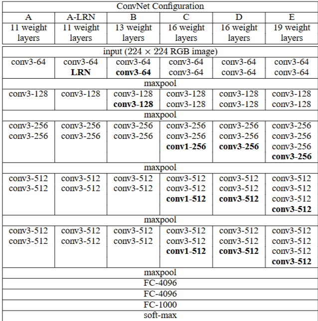

# 1. Paper Information

- Title: VERY DEEP CONVOLUTIONAL NETWORKS FOR LARGE-SCALE IMAGE RECOGNITION
- Paper URL: [https://arxiv.org/pdf/1409.1556]

---

# 2. Motivation

<!--
왜 이 논문이 등장했는가?
기존 연구의 문제점은 무엇이었는가?
이 논문이 해결하려는 문제는 무엇인가?
예를 들어
- Accuracy가 부족했다.
- 학습이 어려웠다.
- 계산량이 너무 컸다.
- 데이터가 부족했다.
-->
- (Krizhevsky et al., 2012)에서는 11*11, stride 4 사용
- (Zeiler & Fergus, 2013; Sermanet et al., 2014)에서는 7*7, stride 2 사용 = 해상도 반토막
- 위 두 논문에서는 큰 필터 사이즈와 stride를 사용해서 합성곱 연산 과정에서 정보 손실 발생
- 대규모 이미지 분류에서의 깊은 CNN의 정확도 조사 
- 전체 레이어에서 3*3 필터를 사용하는 깊은 네트워크 평가
- 16~19층으로 기존 대비 상당한 개선을 보임
- VGG는 다양한 깊이(A~E)를 실험하여 네트워크 깊이가 성능에 미치는 영향을 분석하였다.
- 2014년 이미지넷 챌린지에서 분류 2위함

---

# 3. Core Idea

<!--
논문의 핵심 아이디어를
3~5줄 정도로 요약
"이 논문의 가장 중요한 기여가 무엇인가?"
를 적는다.
-->
- 3 * 3 filter를 사용해서 깊은 층을 쌓음
- 특징 추출은 stride=1의 Convolution으로 꼼꼼하게 하고, 해상도 감소는 Max Pooling에 맡긴다
- 특징을 충분히 추출 후 압축하자

---

# 4. Model Architecture & Forward Process

## Overall Architecture

- 

---

## Components

### Conv3-out_c

**Purpose**
- 이미지의 지역적인 특징을 추출

**Configuration**
- Kernel Size : 3×3
- Stride : 1
- Padding : 1

**Role**
- 작은 Kernel을 반복적으로 사용하여 깊은 표현을 학습
- 이미지의 해상도는 유지

**Output**
- (B, C, H, W) → (B, out_c, H, W)

### maxpool

**Purpose**
- Feature Map의 해상도(Height, Width)를 감소시켜 연산량과 메모리 사용량을 줄임
- 중요한 특징을 유지하면서 불필요한 공간 정보를 제거

**Configuration**
- Kernel Size : 2×2
- Stride : 2
- Padding : 0

**Role**
- 각 2×2 영역에서 가장 큰 활성값만 출력
- Feature Map의 크기를 절반으로 줄임
- Receptive Field를 증가시킴

**Output**
- (B, C, H, W) → (B, C, H/2, W/2)

### FC Layer

**Purpose**
- 추출한 특징을 하나의 벡터로 변환
- 각 클래스에 대한 Logit을 계산하여 분류를 위한 입력을 생성

**Configuration**
- Input : 7 × 7 × 512 = 25,088
- FC1 : 4096
- FC2 : 4096
- FC3 : 1000 (ImageNet Classes)
- Activation : ReLU (FC1, FC2)
- Dropout : 0.5 (FC1, FC2)

**Role**
- Flatten된 Feature Vector를 입력받아 이미지의 의미를 학습
- FC1, FC2를 통해 복잡한 Feature 조합을 학습
- FC3에서 각 클래스에 대한 Logit 출력

**Output**
- (B, 512, 7, 7)
    ↓ Flatten
- (B, 25088)
    ↓ FC1
- (B, 4096)
    ↓ FC2
- (B, 4096)
    ↓ FC3
- (B, 1000)

### Softmax

**Purpose**
- FC Layer에서 출력된 Logits를 확률 분포로 변환

**Role**
- 각 클래스의 예측 확률 계산
- 확률의 총합은 1이 되며, 가장 높은 확률을 가진 클래스를 최종 예측으로 선택하게 됨

---

## Forward Process

1. Input
(B, 3, 224, 224)

2. conv3-64 + maxpool
(B, 3, 224, 224)
↓ conv + ReLU
(B, 64, 224, 224)
↓ conv + ReLU
(B, 64, 224, 224)
↓ maxpool
(B, 64, 112, 112)

3. conv3-128 + maxpool
(B, 64, 112, 112)
↓ conv + ReLU
(B, 128, 112, 112)
↓ conv + ReLU
(B, 128, 112, 112)
↓ maxpool
(B, 128, 56, 56)

4. conv3-256 + maxpool
(B, 128, 56, 56)
↓ conv + ReLU
(B, 256, 56, 56)
↓ conv + ReLU
(B, 256, 56, 56)
↓ conv + ReLU
(B, 256, 56, 56)
↓ maxpool
(B, 256, 28, 28)

5. conv3-512 + maxpool
(B, 256, 28, 28)
↓ conv + ReLU
(B, 512, 28, 28)
↓ conv + ReLU
(B, 512, 28, 28)
↓ conv + ReLU
(B, 512, 28, 28)
↓ maxpool
(B, 512, 14, 14)

6. conv3-512 + maxpool
(B, 512, 14, 14)
↓ conv + ReLU
(B, 512, 14, 14)
↓ conv + ReLU
(B, 512, 14, 14)
↓ conv + ReLU
(B, 512, 14, 14)
↓ maxpool
(B, 512, 7, 7)

7. FC-4096
(B, 512, 7, 7)
↓ flatten
(B, 25088)
↓ FC + ReLU + Dropout
(B, 4096)

8. FC-4096
(B, 4096)
↓ FC + ReLU + Dropout
(B, 4096)

9. FC-1000
(B, 4096)
↓ FC
(B, 1000)

10. soft-max
(B, 1000)
↓ softmax
(B, 1000)

---

# 5. Mathematical Explanation

<!--
논문의 수식을 하나씩 설명

단순히 수식을 적지 말고

왜 사용하는지

각 기호의 의미

직관적인 의미

Gradient는 어떻게 흐르는지

예시

L = CrossEntropy(...)

↓

왜 Cross Entropy를 사용하는가?

↓

수식이 의미하는 것은?
-->

---

# 6. Implementation

<!--
논문를 Scratch로 구현한 내용을 작성합니다.

- 구현한 파일 구조
- 구현 과정
- 구현하면서 어려웠던 점
- 논문와 다르게 구현한 부분
- Random Input으로 Forward Pass 검증
- Tensor Shape 검증
- Parameter 개수 확인

코드 자체보다는 구현 과정과 검증 내용을 중심으로 작성합니다.
-->

---

# 7. Analysis

<!--
논문를 객관적으로 분석합니다.

- 장점
- 단점
- 왜 이러한 구조가 효과적인가?
- 어떤 상황에서 잘 동작하는가?
- 어떤 상황에서는 한계가 있는가?
- 후속 연구에서는 어떻게 개선되었는가?

논문를 비판적으로 분석하는 공간입니다.
-->

- 왜 7*7 필터를 사용안하고 3*3필터를 사용할까?:
    1. 3*3필터를 3번 사용하면 7*7과 같은 receptive field를 가지면서 parameter 수는 더 적음
        3*3*3 = 27개
        7*7 = 49개
    2. layer 사이에 활성화 함수를 사용해 비선형성 향상

---

# 8. Personal Insights

<!--
내가 논문를 읽고 느낀 점

새롭게 알게 된 점

인상 깊었던 부분

프로젝트에 적용할 수 있는 아이디어

다음에 공부할 내용

등을 자유롭게 작성
-->

---