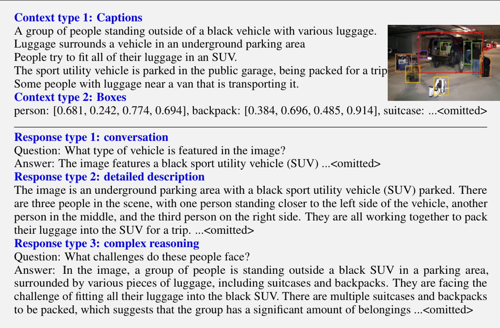
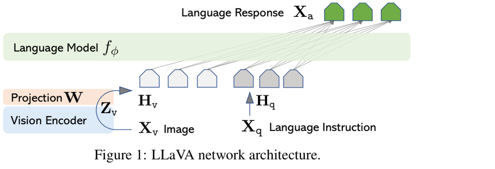
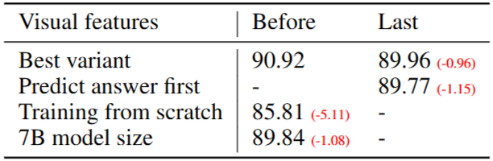

# 1. Paper Information

- Title: Visual Instruction Tuning
- Paper URL: [https://arxiv.org/pdf/2304.08485]

---

# 2. Motivation

- 컴퓨터 비전에서 지정된 레이블을 사용하는 지도 학습은 새로운 카테고리가 추가되면 레이블을 또 추가해야되서 추가적인 레이블 데이터가 필요하기 때문에 모델의 범용성과 활용성이 떨어짐

---

# 3. Core Idea

- 이미지 인코더와 텍스트 인코더를 결합하여 이미지와 그에 대응하는 텍스트 캡션의 관계를 학습
  - 약 4억 개의 (이미지, 텍스트) 쌍으로 구성된 데이터셋으로 학습함
    - 사전 학습 데이터셋의 규모가 크기 때문에 과적합(over-fitting)은 주요 관심사가 아님
  - 이미지 인코더 : resnet50, ViT 사용
  - 텍스트 인코더 : transformer 사용

- 이미지 인코더와 텍스트 인코더를 공동으로 학습시켜 배치 내 N개의 쌍에 대한 이미지 및 텍스트 임베딩의 코사인 유사도를 최대화 하고 ${N^2 - N}$ 개의 잘못된 쌍에 대한 임베딩의 코사인 유사도를 최소화함으로써 다중 모달 임베딩 공간을 학습
  - 이러한 유사도 점수에 대해 대칭 교차 엔트로피 손실(symmetric cross entropy loss)을 최적화
    - 행(이미지축), 열(텍스트축)에 양방향에 대한 loss를 구해서 더하고 평균 냄

- Attention Pooling
  - 전체 이미지를 요약(Q)하고 해당 이미지에서 어떤 패치가 중요한지를 스스로 학습
  - Q(1, d) : 이미지 특성을 평균내고 nn.Linear(d, d) 적용
  - K(n, d)
  - V(n, d)
  - QK^T(1, n) : 패치별 가중치로 볼 수 있음
  - QK^T @ V (1, d) : 패치별 가중치를 곱하고 더함
  - ResNet의 마지막 계층에만 적용

---

# 4. Model Architecture

- Common hyperparameter

- CLIP-ResNet hyperparameter

- CLIP-ViT hyperparameter

---

# 5. Implementation

## Model Implementation

## Verification

| Item | 구현 방식 |
| :--- | :--- |
| Input Shape |  |
| Output Shape |  |
| Total Parameters |  |
| FLOPs |  |

---

# 6. Insights

- 자연어로부터의 학습의 장점
  - 이미지 분류의 라벨링과 비교했을 때, 라벨링이 필요없어 확장성이 좋음
  - 자연어로부터의 학습은 대부분의 비지도 학습이나 자기지도 학습 접근 방식에 비해, 단순히 표현을 학습하는 것에 그치지 않고 그 표현을 언어와 연결하여 유연한 제로샷 전이를 가능하게 한다는 중요한 장점이 있음

- 코사인 유사도에 np.exp(t)를 곱하는 이유
  - t : log(1/τ​)
  - np.exp(t) : 학습 가능한 유사도 확대 배율
    - 원문의 초기값 설정은 `약 14.29`이고, 모델이 학습 과정에서 적절한 확대 배율을 찾게됨
    - exp()를 취함으로써 항상 양수가 나오게 함
  - 코사인 유사도의 범위는 `-1 ~ 1`로 너무 좁음
    - 코사인 유사도가 `[0.3, 0.2, 0.1]`이라고 가정
    - softmax 적용 : `[0.367, 0.332, 0.301]` 세 확률이 비슷함
    - softmax * np.exp(t) :  `[0.367, 0.332, 0.301] * 14.29 = [4.29, 2.86, 1.43]` 정답과 오답이 명확하게 구분됨

- 이미지축, 텍스트축 양방향의 loss를 구하고 평균내는 이유
  - 한 축의 loss만 구하면 임베딩 공간이 해당 축으로만 치우쳐짐
  - 이미지 축(행) loss만 계산하면 각 행의 정답이 가장 높도록 학습하지만, 각 열을 기준으로 봤을 때 특정 텍스트가 여러 이미지에 높은 점수를 줄 수 있음

- 기존 방식인 GAP가 아닌 Attention Pooling을 쓰는 이유
  - GAP는 모든 패치를 동일한 가중치로 보지만 Attention Pooling은 모델이 학습하면서 어떤 패치가 중요한지 스스로 알아냄
  - 강아지 사진이 100개 패치일 때
    - GAP : 모든 패치를 1/100의 가중치로 봄
      - 이미지를 이해하는데 있어 핵심인 강아지 외의 풀과 흙 등 배경 요소들도 똑같이 봐서 노이즈가 생김
        - `강아지` 라는 텍스트의 벡터와 `강아지+배경` 이미지 벡터의 유사도가 낮아짐
    - Attention Pooling : 강아지 0.8, 풀과 흙 0.2 이런 식으로 봄
      - 강아지 특성을 많이 보고 풀과 흙 등의 배경 요소들은 최대한 억제함
        - `강아지` 라는 텍스트의 벡터와의 유사도가 높아지고, 결과적으로 제로샷 전이 성능이 상승함

  - 강아지 텍스트인데 풀 이미지 패치에 높은 가중치를 주는 문제는 없을까?
    - 양방향 loss 최적화를 적용함으로써 방지함
      - 이미지가 풀에 강하게 Attention을 해도 loss를 최적화 하는 과정에서 강아지 텍스트와 풀과의 유사도가 낮기 때문에 학습 하면서 강아지 패치를 강하게 Attention 하게 됨

- 왜 Attention Pooling을 ResNet의 마지막 계층에서만 적용하는가?
  - 마지막 층의 Receptive field가 전체 이미지의 정보를 담고 있기 때문에 가장 잘 요약할 수 있음
  - 전체 이미지의 정보를 안담고 있는 중간 계층에서 하면 파편화가 심하고 효율적이지도 못함

- 다른 이미지 캡션 모델들보다 왜 이미지 특징을 훨씬 잘 추출할까? 
  - Attention Pooling을 적용함으로써 이미지의 핵심을 더 잘 이해함

- 핵심 요소의 가중치는 높이고 부가적인 요소들은 가중치를 억제해서 세부 분류에서는 성능이 떨어질 수도 있음
  - 트랜스포머의 멀티헤드 어텐션 매커니즘을 사용해서 차원축을 특정 갯수로 나눠서 여러 관점에서 보게 한 다음 마지막에 concat 하는건 어떨까?
    - 텍스트 차원과 맞지않아 연산이 안됨 ..
      - 텍스트 차원도 같이 하면되잖음
        - 마지막 계층 전까지는 차원축을 그대로 두고 연산해서 해당 이미지, 텍스트들의 의미를 더 잘 파악하게 두고 마지막 계층만 이미지와 텍스트의 유사도를 여러 관점에서 계산하는 방식으로 가는거지

---