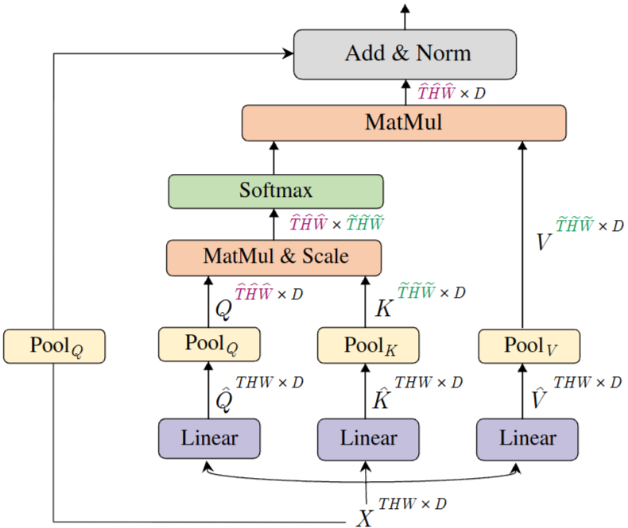
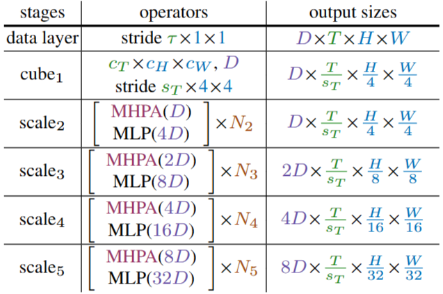

# 1. Paper Information

- Title: Multiscale Vision Transformers
- Paper URL: [https://arxiv.org/pdf/2104.11227]

---

# 2. Motivation

1. 기존의 표준 ViT는 입력부터 출력까지 고정된 해상도와 차원을 유지함, 이는 고해상도 비디오 입력 시 $L^2$에 비례하는 어텐션 연산량을 감당하기 어렵게 만듦

2. 이미지 내의 국소적 관계를 먼저 학습하고 점차 범위를 넓혀가는 CNN의 계층적 특징 추출 방식(Hierarchical structure)이 결여되어 있어, 시각적 신호의 밀도(Density)를 효율적으로 모델링하지 못함

3. 비디오는 공간 정보뿐만 아니라 시간 정보까지 포함된 매우 밀도 높은 신호로 이를 표준 ViT로 처리하려면 엄청난 양의 데이터와 사전 학습(Pre-training)이 필수적으로 요구되는 문제가 발생함

4. 기존의 성공적인 ConvNet 설계 원칙은 '초기 레이어는 간단한 저수준 정보(엣지 등)를, 깊은 레이어는 복잡한 고수준 의미 정보(객체 등)를 처리하는 것'이 비전 모델의 핵심임을 입증함에 따라 트랜스포머의 강력한 함수 근사 능력(Arbitrary function approximation)에 '피라미드 구조(해상도는 낮추고 채널은 넓히는)'를 결합함으로써, 더 적은 연산량으로 더 정교한 시공간 표현을 학습하자

5. 당시 concurrent 연구들(ViViT, TimeSformer 등)은 거대한 외부 데이터셋(ImageNet-21K 등)의 사전 학습 없이는 성능을 내기 어려웠음, MViT는 구조적인 개선(Pooling Attention)만으로, 별도의 거대 사전 학습 없이도 적은 연산량으로 경쟁 모델을 압도하는 '데이터 효율적인 모델'을 구축하고자 함

## Core Idea

- 네트워크의 입력에서 출력으로 갈수록 해상도를 Pooling 하여 줄이면서 임베딩 차원을 확장시킴
  - MHPA(Multi Head Pooling Attention, MHPA) : 트랜스포머 블록 내에서 해상도를 줄이는 연산
    - Attention 연산은 시퀀스 길이의 제곱에 따른 연산량이므로 Q, K, V 를 Pooling 하는 것은 모델의 연산 및 메모리에 상당한 이점을 제공함

- 해상도 축소 비율과 채널 확장 비율을 동기화하여 전체 단계에서의 FLOPs를 일정하게 유지함
  - 공간-시간 해상도를 $4\times$ 줄일 때, 채널 차원을 $2\times$ 확장 
  - 이는 CNN의 설계 원칙과 유사하며, 네트워크의 특정 단계에 연산이 과도하게 집중되는 병목 현상을 방지

- 공간 위치와 시간 위치를 하나의 텐서로 섞지 않고 분리하여 학습
  - 공간 전용 임베딩과 시간 전용 임베딩을 독립적으로 생성한 뒤, 입력 시퀀스에 결합
  - 시간적 순서에 대한 Inductive Bias를 강화하여, 모델이 외형(Appearance)뿐만 아니라 비디오의 동적인 시간 흐름을 인식하게 함

- 데이터 패치(Data sequence)에는 풀링을 적용하지만, 클래스 토큰(Class Token)은 풀링하지 않고 모든 스테이지에 유지함
  - 초기 데이터의 상세한 정보부터 최종 단계의 추상적 의미까지, 클래스 토큰이 네트워크 전체의 맥락(Context)을 소실 없이 요약할 수 있도록 보장함

---

# 3. Model Architecture & Forward Process

## Overall Architecture

- MViT base model

## Components

### Multi-Head Pooling Attention (MHPA)

**Purpose**
- 트랜스포머 블록 내에서 공간-시간 해상도를 유연하게 조절하며 특징 계층을 형성합니다.

**Configuration**
- **Pooling Operator ($P$)**: 쿼리($\hat{Q}$), 키($\hat{K}$), 값($\hat{V}$) 텐서에 커널 크기($k$), 스트라이드($s$), 패딩($p$)을 적용하여 시퀀스 길이를 축소합니다.

- **Flexible Attention**: 쿼리, 키, 값에 서로 다른 스트라이드를 적용하여 어텐션 연산의 연산량과 메모리 사용량을 획기적으로 줄입니다.

**Role**
- 계층적으로 특징의 밀도를 조절하여, 초기 층에서는 미세한 시각 정보를, 깊은 층에서는 고차원 시맨틱 정보를 모델링합니다.

**Output**
- 시퀀스 길이가 감소된 형태의 텐서를 출력하며, 뒤따르는 MLP 층의 효율적인 확장을 가능하게 합니다.

---

## Forward Process

### 1. Cube Embedding (Initial Stage)
입력 비디오를 공간-시간 큐브로 투영하여 첫 번째 잠재 시퀀스를 생성
- **Input**: $(B, T, H, W, 3)$
- **Output (cube1)**: $(B, T_{seq} \times H_{seq} \times W_{seq}, D)$
  - 예: $8 \times 224 \times 224$ 입력 시 $\rightarrow$ $(B, 8 \times 56 \times 56, 96)$

### 2. Multi-Scale Transformer Stages
각 스테이지 전환 시 MHPA의 Query Pooling을 통해 해상도가 감소하고, MLP를 통해 채널 차원이 확장됨

| Stage | 해상도 (Sequence Length: $\tilde{L}$) | 채널 차원 ($D$) | 출력 형태 (Batch, $\tilde{L}$, $D$) |
| :--- | :--- | :--- | :--- |
| **Stage 1** | $T/s_T \times 56 \times 56$ | $96$ | $(B, 8 \times 56 \times 56, 96)$ |
| **Stage 2** | $T/s_T \times 28 \times 28$ | $192$ | $(B, 8 \times 28 \times 28, 192)$ |
| **Stage 3** | $T/s_T \times 14 \times 14$ | $384$ | $(B, 8 \times 14 \times 14, 384)$ |
| **Stage 4** | $T/s_T \times 7 \times 7$ | $768$ | $(B, 8 \times 7 \times 7, 768)$ |

*   $\tilde{L} = T_{seq} \times H_{seq} \times W_{seq}$
*   각 단계 전환 시 해상도는 줄어들고 채널 차원은 $2\times$씩 증가하여 연산 복잡도를 일정하게 유지

### 3. Classification Head (Final Output)
최종 단계의 특징 맵에서 클래스(처음에 넣어줌 $\tilde{L}$=L+1) 임베딩을 추출하여 최종 예측을 수행

$$
(B, \tilde{L}, D_{final}) \rightarrow (B, D_{final}) \rightarrow (B, K)
$$

- $K$: 클래스 개수
- MViT-B 기준 최종 특징 벡터는 $(B, 768)$의 형태를 가집니다.

---

# 4. Mathematical Explanation (New Ideas)

---

# 5. Implementation

## Directory Structure

MViT/
├── README.md
├── 
└── 

## Model Implementation

## Verification

| Item | 구현 방식 |
| :--- | :--- |
| Input Shape |  |
| Output Shape |  |
| Total Parameters |  |
| FLOPs |  |

---

# 6. Analysis & Insights

## Merits

- **기존 ViT보다 효율적인 시공간 모델링**
  - 기존 ViT(표준 ViT)는 고정된 고해상도 시퀀스를 전역적으로 처리하여 연산량이 매우 큼.
  - MViT는 계층적 풀링을 통해 점진적으로 시퀀스 길이를 줄여, 초기에는 고해상도 정보를, 나중에는 저해상도 고차원 정보를 효과적으로 처리하는 효율성을 달성함.

- **기존 ViT보다 비전 작업(특히 비디오)에 적합한 강력한 Inductive Bias**
  - 표준 ViT는 비디오의 프레임 순서를 섞어도 성능 변화가 거의 없어, 사실상 시간 정보를 무시하고 정적인 외형(Appearance)만 학습하는 경향이 있음.
  - MViT는 시공간 풀링 구조를 통해 시간적 관계를 명확히 학습하므로, 프레임 순서가 섞였을 때 성능이 크게 하락함. 이는 모델이 시간 정보를 매우 적극적으로 활용하고 있음을 보여주는 긍정적인 지표임.

- **기존 모델 대비 압도적인 효율성과 범용성**
  - MViT는 대규모 외부 데이터(ImageNet-21K 등) 없이도 'From-scratch' 학습만으로 기존의 복잡한 비디오 Transformer(ViViT, TimeSformer 등)보다 훨씬 적은 연산량과 파라미터로 높은 정확도를 기록함.
  - 비디오뿐만 아니라 시간 차원을 제거하여 이미지 분류 모델로도 직접 활용 가능하며, 기존 ViT 대비 우수한 성능을 보임.

## Demerits

- **손실되는 저수준 정보**: 각 단계마다 수행되는 공간-시간 풀링(Pooling)은 연산 효율을 극대화하지만, 그 과정에서 미세한 디테일(예: 작은 물체의 움직임, 정교한 손동작)이 영구적으로 소실됨.

- **단방향 구조의 한계**: CNN의 FPN(Feature Pyramid Network)과 같이 저해상도 특징과 고해상도 특징을 결합하는 '정보 복원 메커니즘'이 부재함.
  - MViTv2에서 도입함

- **위치 정보의 불안정성**: 각 스테이지마다 시퀀스의 해상도($\tilde{L}$)가 변함에 따라, 고정된 크기의 위치 임베딩이나 상대적 위치 편향(Relative Position Bias)을 매번 보간(Interpolation)해야 함.

- **학습의 어려움**: 해상도가 달라질 때마다 위치 정보를 다시 학습하거나 근사해야 하므로, 모델이 공간적 맥락을 '일관성 있게' 이해하는 것을 방해할 수 있음.

## Why?

- **왜 다중 해상도(Multiscale) 구조가 필요한가?**
  - 영상 데이터는 픽셀 간의 밀도가 매우 높고 공간-시간 정보가 밀집되어 있음.
  - 초기 단계에서 높은 해상도로 '단순한 저수준 시각 정보'를 확보하고, 깊은 단계로 갈수록 해상도를 줄여 '복잡한 고수준 의미 정보'를 모델링하는 과정이 인간의 시각 시스템 계층 구조와 일치함.

- **왜 Query Pooling이 핵심인가?**
  - 표준 트랜스포머는 전체 시퀀스 길이에 대해 이차(Quadratic) 복잡도를 가짐.
  - MViT는 단계가 넘어갈 때 쿼리 텐서에 풀링을 적용하여 시퀀스 길이($L$) 자체를 근본적으로 줄임으로써, 연산 복잡도와 메모리 사용량을 획기적으로 낮추면서도 핵심적인 시공간 맥락을 클래스 토큰으로 전달할 수 있게 함.

---