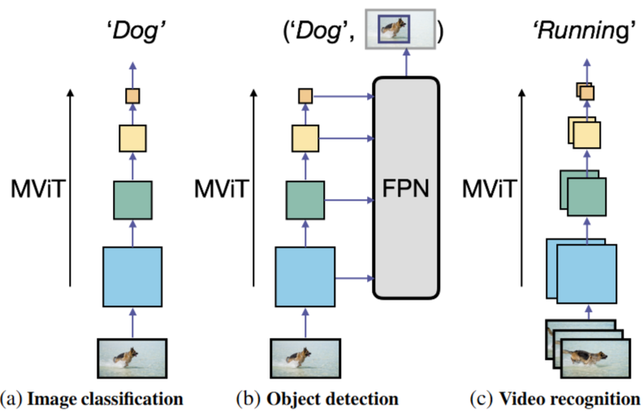
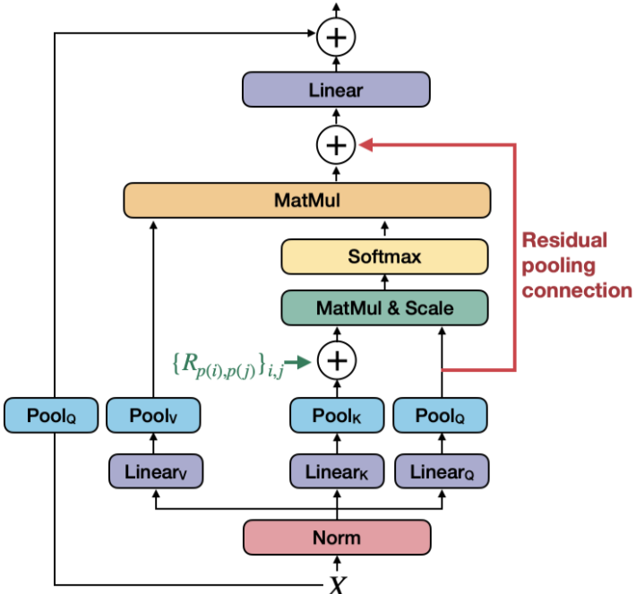
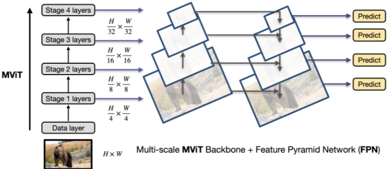

# 1. Paper Information

- Title: MViTv2: Improved Multiscale Vision Transformers for Classification and Detection
- Paper URL: [https://arxiv.org/pdf/2112.01526]

---

# 2. Motivation

1. ViT(Vision Transformer)는 이미지 분류에서는 성공적이었지만, **객체 탐지(Object Detection)**나 비디오 이해(Video Understanding) 같은 고해상도/고차원 태스크로 넘어가면 패치 개수(토큰)가 급격히 늘어나는데, 셀프 어텐션은 토큰 수의 **제곱(\(O(N^2)\))**에 비례하는 연산량을 소모함
저자들은 이 문제를 해결하기 위해 **'풀링 어텐션(Pooling Attention)'**이라는 효율적인 방식을 도입함

2. 절대적 위치 임베딩의 구조적 한계
기존의 Vision Transformer는 위치 정보를 줄 때 '절대적 위치 임베딩'을 사용했는데, 이는 비전 모델의 핵심 원리인 **'이동 불변성(Shift-invariance)'**을 깨뜨림
객체가 이미지 안에서 움직여도 모델은 그 객체를 동일하게 인식해야 하지만 절대 좌표를 학습하면 "객체가 어디에 있는가"에 모델이 과도하게 의존함
저자들은 "위치가 바뀌어도 객체 내 구성 요소(귀, 코, 꼬리 등)들 사이의 상대적 관계는 변하지 않는다"는 점에 주목하며 이동 불변성을 보장하는 상대적 위치 임베딩을 도입함

3. 저자들은 "이미지, 객체 탐지, 비디오 3가지 도메인에서 모두 최고의 성능을 내는 하나의 통합된 백본을 만들 수는 없을까?" 라는 고민을 함
즉, MViTv1에서 제안했던 풀링 어텐션 개념을 더 발전시켜, 아주 범용적으로 쓰일 수 있는 강력한 '시공간 백본'을 만드는 것이 이 연구의 궁극적인 동기

## Core Idea

- Pooling Attention
  - Attention 연산 전에 Q, K, V에 Pooling을 적용해서 해상도 및 연산량을 감소시킴
  - stride of Q : 해상도와 연산량을 줄임
  - stride of K and v : 연산량을 줄임
  - K와 V의 stride는 같아야 attention 연산을 수행할 수 있음

- Residual Pooling Connection
  - Attention 연산 전 Pooling 한 Q를 Attention 연산 후 결과 값에 더함
  - 새로운 아이디어라기 보다는 Pooling을 적용함으로써 해상도가 바꼇으니 당연히 맞춰서 하는 것

- Decomposed Relative Positional Embeddings
  - 객체의 위치와 상관없이 객체의 구성 요소(귀, 코, 꼬리 등)가 일정하면 동일한 패턴으로 인식하게 함.
  - 모든 3차원 조합($T \times W \times H$)을 학습하는 대신 축별로 분해하여 $O(T+W+H)$의 파라미터만 학습합니다.
  - 상대적 위치 정보를 $R$ 테이블에서 참조하여 어텐션 스코어에 더합니다.
  $$ \text{Attn}(Q, K, V) = \text{Softmax}\left(\frac{QK^\top + E(\text{rel})}{\sqrt{d}}\right)V
  $$
    - $QK^\top$ : 내용 유사도
    - $E(rel)$ : 위치 중요도

    - 여기서 위치 편향 $E(\text{rel})_{ij}$는 각 축의 거리 임베딩 합으로 계산됩니다.
    $$
    R_{p(i), p(j)} = R_{hh}(i),h(j) + R_{ww}(i),w(j) + R_{tt}(i),t(j)
    $$

### Decomposed Relative Positional Embeddings 계산 과정 예시

#### [가정 상황]
*   **격자 크기:** $14 \times 14$ ($224 \times 224$ 이미지, $16 \times 16$ 패치)
*   **토큰 $i$ 위치:** $(0, 0)$
*   **토큰 $j$ 위치:** $(0, 1)$ (가로로 바로 옆에 있는 토큰)
*   **임베딩 차원($D$):** 4차원 (예시를 위해 단순화)

#### Step 1: 거리 차이 계산
*   높이 거리 차이 $\Delta h = |0 - 0| = 0$
*   너비 거리 차이 $\Delta w = |0 - 1| = 1$

#### Step 2: $R$ 테이블에서 임베딩 벡터 참조 (Look-up)
* $R$ shape : 2L-1, D
  * L : 토큰 수
  * D : 모델 임베딩 차원과 같음 

모델이 이미 학습을 마친 $R$ 테이블에서 해당 거리 값을 가져옵니다.

*   $R_{hh}(0) = [0.1, 0.2, 0.1, 0.0]$
*   $R_{ww}(1) = [0.3, 0.1, -0.2, 0.1]$

#### Step 3: 분해된 임베딩 합산
$$
R_{p(i),p(j)} = [0.1, 0.2, 0.1, 0.0] + [0.3, 0.1, -0.2, 0.1] = [0.4, 0.3, -0.1, 0.1]
$$

#### Step 4: 어텐션 스코어에 적용
쿼리 벡터 $Q_i = [0.5, 1.0, 0.2, 0.5]$라면:
*   $E(\text{rel})_{ij} = Q_i \cdot R_{p(i),p(j)}$
*   $E(\text{rel})_{ij} = (0.5 \times 0.4) + (1.0 \times 0.3) + (0.2 \times -0.1) + (0.5 \times 0.1)$
*   $E(\text{rel})_{ij} = 0.2 + 0.3 - 0.02 + 0.05 = \mathbf{0.53}$

#### [최종 결과]
계산된 값 **0.53**을 어텐션 스코어($QK^\top$)에 더함  
이 값은 모델이 $(0, 0)$ 위치의 토큰이 $(0, 1)$ 위치의 토큰을 얼마나 중요한 관계로 볼지 결정하는 '위치 편향(Position Bias)'으로 작용

---

# 3. Model Architecture & Forward Process

## Overall Architecture
- Three Visual Recognition Task

- Pooling Attention

- FPN for object detection

## Components

### Swin Transformer Block

**Purpose**
- 이미지 패치의 특징을 변환하고, 주변 패치 간의 관계를 학습합니다.

**Configuration**
- **Window-based MSA**: 전체 이미지가 아닌 작은 윈도우 안에서만 셀프 어텐션을 계산합니다.
- **Shifted Window MSA**: 다음 블록에서 윈도우 위치를 이동하여 서로 다른 윈도우의 정보가 연결되도록 합니다.
- **MLP Block**: 각 패치의 특징을 두 번의 선형 변환과 GELU 활성화 함수로 정제합니다.
- **LayerNorm & Residual Connection**: 각 블록에 정규화와 잔차 연결을 적용하여 안정적인 학습을 돕습니다.

**Role**
- 전체 패치 간의 관계를 계산하는 방식보다 연산량을 줄입니다.
- Shifted Window를 통해 지역 윈도우의 한계를 보완합니다.

**Output**
- 입력과 동일한 패치 개수와 특징 차원을 유지합니다.
- 출력 형태: $(B, H \times W, C)$

### Patch Merging

**Purpose**
- 네트워크가 깊어질수록 패치 수를 줄이고 더 높은 수준의 특징을 추출합니다.

**Mechanism**
- 인접한 $2 \times 2$ 패치의 특징을 하나로 합칩니다.
- 특징 맵의 해상도는 절반으로 줄고, 채널 차원은 증가합니다.

**Role**
- CNN처럼 단계적인 계층적 특징 맵을 생성합니다.
- 객체 탐지와 시맨틱 세그멘테이션에 필요한 다양한 해상도의 특징을 제공합니다.

## Forward Process

### 1. Patch Partition

- 입력 이미지를 작은 패치로 나눕니다.
- 기본 패치 크기는 $4 \times 4$입니다.
- 각 패치를 하나의 토큰으로 변환합니다.

### 2. Linear Embedding

- 패치의 픽셀 값을 선형 변환하여 특징 벡터로 변환합니다.
- 첫 번째 단계의 출력 형태는 다음과 같습니다.

$$
(B, H/4 \times W/4, C)
$$

### 3. Swin Transformer Blocks

- 각 단계에서 일반 윈도우와 Shifted Window를 번갈아 사용합니다.
- 윈도우 내부의 패치 관계를 학습하고, Shifted Window를 통해 윈도우 간 정보를 교환합니다.

### 4. Patch Merging

- 각 단계가 끝난 뒤 인접한 패치를 병합합니다.
- 단계가 깊어질수록 해상도는 낮아지고 특징 차원은 커집니다.

| Stage | 특징 맵 해상도 |
|---|---|
| Stage 1 | $H/4 \times W/4$ |
| Stage 2 | $H/8 \times W/8$ |
| Stage 3 | $H/16 \times W/16$ |
| Stage 4 | $H/32 \times W/32$ |

### 5. Position Information

- Swin Transformer는 ViT처럼 별도의 절대적 위치 임베딩을 사용하지 않습니다.
- 대신 각 윈도우의 패치 간 상대적 위치를 나타내는 상대적 위치 편향(relative position bias)을 사용합니다.
- 이를 통해 윈도우 안에서 패치의 공간적 관계를 학습합니다.

### 6. Final Output

- 이미지 분류에서는 마지막 Stage의 특징 맵에 전역 평균 풀링을 적용합니다.
- 이후 선형 분류기를 사용해 최종 클래스 예측을 수행합니다.

$$
(B, H/32 \times W/32, C) \rightarrow (B, C) \rightarrow (B, K)
$$

- 객체 탐지와 시맨틱 세그멘테이션에서는 각 Stage의 다중 해상도 특징 맵을 백본 출력으로 사용합니다.

---

# 4. Mathematical Explanation (New Ideas)

---

# 5. Training Configuration

### 훈련 하이퍼파라미터 및 데이터 전처리

| 분류 | 항목 | 설정 및 상세 설명 |
| :--- | :--- | :--- |
| **Optimization** | Optimizer | AdamW 사용 |
| | ImageNet-1K 학습 | 300 epochs, 초기 학습률 $0.001$, cosine decay, 20 epochs warm-up |
| | ImageNet-22K 사전 학습 | 90 epochs, 초기 학습률 $0.001$, linear decay, 5 epochs warm-up |
| | Weight Decay | 일반 학습에서 $0.05$, ImageNet-22K 사전 학습에서 $0.01$ |
| **Data** | Classification | ImageNet-1K 및 ImageNet-22K 사용 |
| | Object Detection | COCO 2017 사용 |
| | Semantic Segmentation | ADE20K 사용 |
| **Preprocessing** | Patch Processing | 입력 이미지를 $4 \times 4$ 패치로 분할 |
| | ImageNet 입력 크기 | 기본 $224 \times 224$, 일부 실험에서 $384 \times 384$로 미세 조정 |
| | Detection 입력 크기 | 짧은 변을 $480$에서 $800$ 사이로 조정하고 긴 변은 최대 $1333$으로 제한 |
| | Segmentation 입력 크기 | Swin-T와 Swin-S는 $512 \times 512$, Swin-B와 Swin-L은 $640 \times 640$ 사용 |
| **Batching** | ImageNet-1K | 배치 크기 $1024$ |
| | ImageNet-22K | 배치 크기 $4096$ |
| | Object Detection | 배치 크기 $16$ |
| **Augmentation** | Image Classification | RandAugment, Mixup, CutMix, Random Erasing, Stochastic Depth 사용 |
| | Semantic Segmentation | 무작위 좌우 반전, 무작위 크기 조정, 색상 왜곡 사용 |
| **Fine-tuning** | ImageNet 해상도 조정 | $224 \times 224$로 학습한 모델을 $384 \times 384$ 입력에 맞게 미세 조정 |
| | ImageNet-22K 전이 | ImageNet-22K로 사전 학습한 모델을 ImageNet-1K에서 미세 조정 |
| **Hardware** | 실험 환경 | V100 GPU에서 처리량과 실제 속도를 측정 |

## Notes

- ImageNet-1K 학습에서는 300 epochs, 초기 학습률 $0.001$, cosine decay, 20 epochs의 선형 warm-up을 적용합니다.
- ImageNet-22K 사전 학습에서는 90 epochs, 초기 학습률 $0.001$, linear decay, 5 epochs의 warm-up을 사용합니다.
- ImageNet-1K 학습의 weight decay는 $0.05$, ImageNet-22K 사전 학습의 weight decay는 $0.01$입니다.
- 분류 모델은 RandAugment, Mixup, CutMix, Random Erasing, Stochastic Depth 등의 데이터 증강 및 정규화 기법을 사용합니다.
- ImageNet-1K에서는 기본 입력 크기로 $224 \times 224$를 사용하고, 더 큰 입력 크기인 $384 \times 384$에서는 기존 모델을 미세 조정합니다.
- Swin Transformer는 ViT처럼 별도의 class 토큰을 사용하지 않습니다.
- 이미지 분류에서는 마지막 Stage의 특징 맵에 전역 평균 풀링을 적용한 뒤 선형 분류기를 사용합니다.
- 객체 탐지 실험에서는 AdamW, 초기 학습률 $0.0001$, weight decay $0.05$, 배치 크기 $16$, 36 epochs의 학습 일정을 사용합니다.
- 시맨틱 세그멘테이션 실험에서는 AdamW, 초기 학습률 $6 \times 10^{-5}$, weight decay $0.01$, linear decay, 1,500 iterations의 warm-up을 사용합니다.

---

# 6. Implementation

## Directory Structure

Swin/
├── README.md
├── model.py
└── main.py

## Model Implementation

- **Swin Transformer Architecture**
  - 논문의 계층적 구조를 `BasicLayer`와 `PatchMerging` 클래스로 나누어 구현함.
  - Swin-T 설정은 `embed_dim=96`, `depths=(2, 2, 6, 2)`, `num_heads=(3, 6, 12, 24)`로 지정함.

- **Patch Embedding**
  - 논문의 Patch Partition과 Linear Embedding을 `nn.Conv2d` 하나로 구현함.

- **Window-based Multi-Head Self-Attention**
  - 논문의 윈도우 단위 어텐션을 `window_partition()`과 `WindowAttention` 클래스로 구현함.

- **Relative Position Bias**
  - 논문의 상대적 위치 편향을 `relative_position_bias_table`과 `relative_position_index`로 구현함.

- **Shifted Window Attention**
  - 논문의 일반 윈도우와 Shifted Window 교대 방식을 `shift_size=0`과 `shift_size=window_size // 2`로 구현함.
  - `torch.roll()`을 사용해 특징 맵을 순환 이동하고, `create_attention_mask()`로 윈도우 경계를 넘는 잘못된 어텐션을 차단함.

- **Swin Transformer Block**
  - 논문의 두 개의 연속된 Swin Transformer Block을 `SwinTransformerBlock` 클래스로 구현함.
  - 각 블록에 `LayerNorm`, 어텐션, MLP, 잔차 연결을 적용함.
  - `BasicLayer`에서 블록 인덱스에 따라 일반 윈도우와 Shifted Window를 번갈아 배치함.

- **MLP Block**
  - 논문의 두 층 MLP와 GELU 활성화 함수를 `MLP` 클래스로 구현함.
  - 중간 차원은 `int(dim * mlp_ratio)`로 계산하며 기본 확장 비율은 `4.0`임.

- **Token Embedding**
  - 논문의 패치 토큰 생성을 `patch_embed`의 `nn.Conv2d`와 `patch_norm`의 `LayerNorm`으로 구현함.

- **Patch Merging**
  - 논문의 인접한 패치 병합을 `PatchMerging` 클래스로 구현함.
  - `x0`, `x1`, `x2`, `x3`로 네 위치의 패치를 추출한 뒤 `torch.cat()`으로 결합하고, 선형 변환을 통해 채널 차원을 변경함.

- **Weight Initialization**
  - 논문의 초기화 설정을 `_init_weights()`에 구현함.

## Verification

| Item | 구현 방식 |
| :--- | :--- |
| Input Shape | `torch.randn(1, 3, 224, 224)`로 테스트함 |
| Output Shape | 분류 헤드의 출력 `[1, 1000]` 확인함 |
| Total Parameters | 28,288,354 |
| FLOPs | 4509194496 |

---

# 7. Analysis & Insights

## Merits

- **기존 ViT보다 효율적인 고해상도 처리**
  - 기존 ViT는 전체 패치에 전역 셀프 어텐션을 적용해 입력 크기에 따라 연산량이 제곱으로 증가함.
  - Swin Transformer는 고정된 윈도우 내부에서만 어텐션을 계산해 입력 이미지 크기에 대해 선형적인 연산 복잡도를 달성함.

- **기존 ViT보다 다양한 비전 작업에 적합함**
  - 기존 ViT는 단일 해상도의 특징 맵을 생성해 객체 탐지나 시맨틱 세그멘테이션에 직접 적용하기 어려움.
  - Swin Transformer는 Patch Merging을 통해 CNN과 유사한 계층적 다중 해상도 특징 맵을 생성함.

- **기존 CNN 백본과 비교해 경쟁력 있는 성능을 보임**
  - 논문 실험에서 Swin-T는 비슷한 계산량의 ResNet-50보다 여러 객체 탐지 프레임워크에서 더 높은 성능을 보임.
  - Swin Transformer는 ImageNet 분류뿐 아니라 COCO 객체 탐지와 ADE20K 시맨틱 세그멘테이션에서도 강한 성능을 보임.

## Demerits

- **단순한 ViT보다 구현이 복잡함**
  - ViT의 전역 어텐션보다 window partition, cyclic shift, attention mask, Patch Merging을 추가로 구현해야 함.

## Why?

- **왜 Shifted Window가 필요한가?**
  - 고정된 윈도우만 사용하면 윈도우 경계에서 정보가 단절됨.
  - Shifted Window는 다음 블록에서 분할 기준을 바꾸는데 이걸 반복하면서 점차 전역적인 정보를 볼 수 있게됨

---