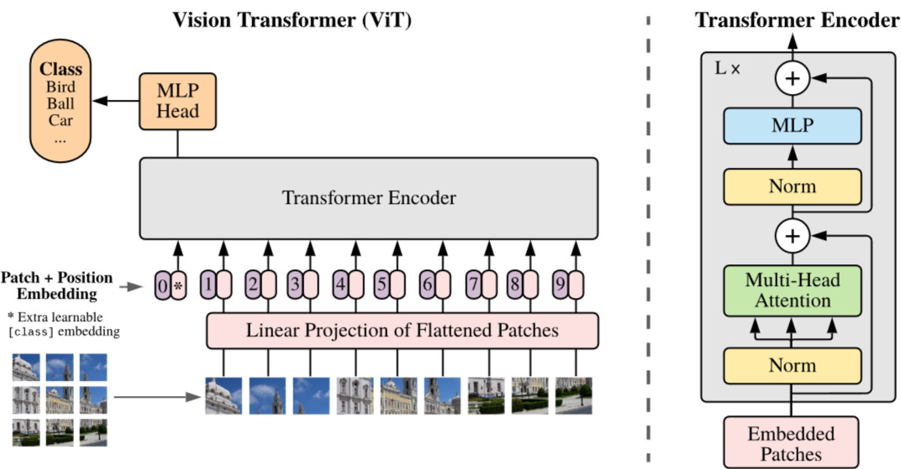
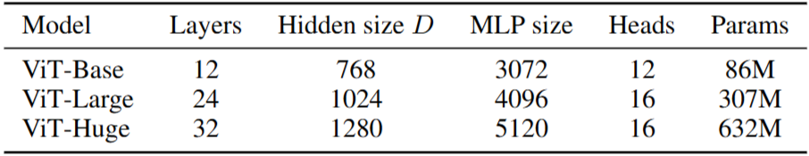

# 1. Paper Information

- Title: AN IMAGE IS WORTH 16X16 WORDS: TRANSFORMERS FOR IMAGE RECOGNITION AT SCALE
- Paper URL: [https://arxiv.org/pdf/2010.11929]

---

# 2. Motivation

## Problem

- 컴퓨터 비전 분야에서 CNN 구조의 독점과 한계
    - 기존의 비전 모델들은 컨볼루션(convolutional) 신경망을 기반으로 한 구조가 지배적이며, 이는 현대의 표준으로 자리 잡았습니다.
    - 이러한 CNN 기반 접근은 지역적 특징 추출과 이동 불변성(translation equivariance)이라는 귀납적 편향(inductive bias)에 크게 의존합니다.
    - 최근 연구들에서는 CNN과 셀프 어텐션(self-attention)을 결합하거나 컨볼루션을 대체하려는 시도가 있었으나, 특수한 어텐션 패턴을 사용함에 따라 현대적인 하드웨어 가속기에서 효율적으로 확장되지 못했습니다.

## Goal

- CNN 의존성 탈피 및 순수 Transformer 적용
    - CNN에 대한 의존이 필수가 아님을 증명하고, 이미지 패치 시퀀스에 직접적으로 Transformer를 적용하여 우수한 이미지 분류 성능을 달성하고자 합니다.
    - 대규모 데이터셋으로 사전 학습(pre-training)된 모델을 여러 벤치마크 데이터셋으로 전이(transfer)했을 때, 최신 CNN 모델들과 비교하여 동등하거나 더 우수한 성능을 내면서도 학습에 필요한 연산 자원을 획기적으로 줄이는 것을 목표로 합니다.

## Core Idea

- 스케일링을 통한 귀납적 편향 극복
    - 이미지 데이터를 NLP의 단어 토큰처럼 패치(patch) 단위로 분할하고, 이를 Transformer의 표준 구조에 입력하여 모델이 이미지의 공간적 구조를 스스로 학습하도록 설계했습니다.
    - 소규모 데이터셋에서는 CNN이 가진 귀납적 편향이 중요할 수 있으나, 대규모 데이터셋(14M~300M 이미지)으로 학습할 경우 데이터에서 직접 패턴을 학습하는 방식이 귀납적 편향을 능가함을 제시했습니다.
    - 결과적으로, 이미지의 2차원적 구조에 대한 사전 지식을 최소화하고 대규모 데이터 스케일링을 통해 모델의 성능을 극대화하는 범용적인 구조를 실현했습니다.

---

# 3. Model Architecture & Forward Process

## Overall Architecture

## Components

### Transformer Encoder
**Purpose**
- 일련의 Transformer 인코더 블록을 쌓아 구성하며, '멀티 헤드 셀프 어텐션'과 'MLP 블록'을 통해 이미지 패치 간의 복잡한 의존성을 병렬적으로 학습함.

**Configuration**
- **Multi-Head Self-Attention (MSA)**: 패치 임베딩을 여러 헤드로 나누어 처리함으로써 이미지 내의 먼 거리 패치들 간의 관계를 입체적으로 파악함.
- **MLP Block**: 각 패치마다 독립적인 2단계 선형 변환과 GELU 활성화 함수를 적용하여 특징을 정제함.
- **Residual Connection & Layer Norm**: 각 서브 레이어마다 잔차 연결을 수행하고 레이어 정규화(Layer Normalization)를 적용하여 깊은 네트워크의 학습 안정성을 확보함.

**Role**
- 잔차 연결을 통해 정보 손실 없이 깊은 층의 학습을 지원하고, 병렬적 어텐션 구조를 통해 컨볼루션 연산의 지역적 한계를 극복함.

**Output**
- 인코더: (B, $N+1$, $D$)
  - (B: 배치 사이즈, N: 패치 개수, D: 임베딩 차원, +1은 [class] 토큰)

### Positional Embedding
**Purpose**
- 모델 구조 내에 고정된 공간적 순서 정보가 없으므로, 패치들의 위치 정보를 모델에 학습 가능한 형태로 주입함.

**Mechanism**
- 표준적인 1차원 학습 가능(learnable) 위치 임베딩을 패치 임베딩에 더해줌. 2차원 공간 정보를 위해 별도의 복잡한 인코딩을 시도했으나, 1차원 학습 가능 임베딩과 유의미한 성능 차이가 없음을 확인함.

**Role**
- 패치가 이미지 내 어디에 위치하는지에 대한 정보를 유지함으로써 모델이 공간적 구조를 이해할 수 있게 함.

## Forward Process

### 1. Patch Embedding
- 입력 이미지를 $P \times P$ 크기의 패치로 분할하고 평탄화하여 선형 투영을 수행함.
- [class] 토큰과 Position Embedding을 결합하여 Transformer 입력 형태로 변환함.
- **Output Shape**: $(B, N+1, D)$

### 2. Encoder Stack
- $L$개의 Transformer Encoder 블록을 통과하며 Self-Attention과 MLP를 수행함.
- 각 블록마다 입력과 동일한 크기의 시퀀스 정보를 유지함.
- **Output Shape**: $(B, N+1, D)$

### 3. Classification Head
- 인코더의 마지막 출력에서 맨 앞에 위치한 [class] 토큰($z_L^0$)만 추출함.
- 이 벡터를 최종 클래스 수($K$)에 맞춰 선형 변환함.
- **Output Shape**: $(B, K)$

### 4. Final Output
- Softmax를 적용하여 각 클래스에 대한 확률 분포를 계산함.
- **Output Shape**: $(B, K)$

---

# 4. Mathematical Explanation (New Ideas)

---

# 5. Training Configuration

### 훈련 하이퍼파라미터 및 데이터 전처리
| 분류 | 항목 | 설정 및 상세 설명 |
| :--- | :--- | :--- |
| **Optimization** | Optimizer | Adam ($\beta_1=0.9, \beta_2=0.999$) |
| | Learning Rate | 선형 Warmup(10,000 steps) 후 선형 감쇠(decay) 적용 |
| | Regularization | Weight Decay (0.1), Dropout (종료 시 0.1) |
| **Data/Prep** | Datasets | ImageNet (1k), ImageNet-21k, JFT-300M |
| | Preprocessing | 이미지 패치 분할 ($16 \times 16$ 또는 $14 \times 14$) |
| | Batching | 대규모 병렬 처리를 위해 배치 사이즈 4096 적용 |
| **Hardware** | TPU | Google TPUv3 가속기 사용 |
| **Fine-tuning** | Strategy | SGD (momentum 0.9), 고해상도 미세 조정(384) |

## Notes
- **Learning Rate Schedule**: 학습 초기 모델의 불안정을 방지하기 위해 10,000 스텝 동안 선형적으로 학습률을 증가(Warmup)시키며, 이후에는 선형 감쇠 방식을 사용하여 안정적인 수렴을 유도함.
- **Regularization**: 
    - **Weight Decay**: 데이터셋 규모가 클수록 높은 가중치 감쇠(0.1)를 적용하는 것이 모델 전이(transfer) 성능에 중요하게 작용함.
    - **Label Smoothing**: 사전 학습 단계에서 모델의 과잉 확신을 방지하고 일반화 성능을 높이기 위해 레이블 스무딩 기법을 활용함.
- **Resolution Adaptation**: 사전 학습(224 해상도) 후 미세 조정 단계에서 더 높은 해상도(384 해상도)로 조정하며, 이때 기존 위치 임베딩(position embedding)을 2D 보간(interpolation)하여 적용함.
- **Checkpointing & Averaging**: 최종 모델 성능 향상을 위해 체크포인트 평균화 기법을 적용할 수 있으며, 특히 ImageNet 미세 조정 시 Polyak-Juditsky 평균화를 사용하여 성능을 안정화함.
- **Inference Strategy**: 학습된 모델의 최종 [class] 토큰을 사용하여 클래스를 분류하며, 계산 효율을 위해 입력 해상도에 따른 배치 사이즈를 최적화하여 연산함.

---

# 6. Implementation

## Directory Structure

ViT/
├── README.md
├── model.py
└── main.py

## Model Implementation

- Transformer Architecture를 PyTorch로 Scratch 구현
- Sinusoidal Positional Encoding 구현
  - `sin`, `cos` 함수를 이용하여 위치 정보 생성
  - `register_buffer`를 사용하여 학습되지 않는 Positional Encoding으로 등록
- Multi-Head Attention 구현
  - Query, Key, Value를 각각 Linear Layer로 projection
  - `einops.rearrange`를 이용하여 Multi-Head 형태로 변환
  - Scaled Dot-Product Attention 적용
  - 각 Head의 결과를 결합한 후 Linear Layer를 통해 projection
- Encoder 구현
  - Multi-Head Self-Attention
  - Residual Connection + Layer Normalization
  - Position-wise Feed-Forward Network
  - Residual Connection + Layer Normalization
  - `nn.ModuleList`를 사용하여 여러 Encoder Layer 구성
- Decoder 구현
  - Masked Multi-Head Self-Attention
  - Encoder-Decoder Cross Attention
  - Position-wise Feed-Forward Network
  - 각 Sublayer에 Residual Connection + Layer Normalization 적용
  - `nn.ModuleList`를 사용하여 여러 Decoder Layer 구성
- Feed-Forward Network
  - `Linear → ReLU → Dropout → Linear` 구조
- Attention Mask
  - Encoder Padding Mask
  - Decoder Causal Mask
  - Encoder-Decoder Cross Attention Padding Mask
- Token Embedding
  - Embedding 출력에 `√d_model` scaling 적용
- Weight Initialization
  - Weight Tensor의 차원이 2 이상인 Layer에 Xavier Uniform Initialization 적용
  - Layer Normalization의 1차원 weight는 Xavier Initialization에서 제외

## Verification

| Item             | Result |
| ---------------- | ------ |
| Input Shape      | `[3, 20]`, `[3, 15]` |
| Output Shape     | `[3, 15, 320000]` |
| Total Parameters | `372,138,496` |
| FLOPs            | `9,705,876,480` |

## Notes

- 랜덤한 Source / Target Token을 입력으로 사용하여 순전파 검증

---

# 7. Analysis & Insights

## Merits

- **병렬 처리 극대화**: 순환(Recurrence) 구조를 제거하여 모든 토큰을 병렬로 처리함. 이를 통해 최신 GPU 자원을 최대한 활용하여 학습 속도를 획기적으로 단축함.
- **장거리 의존성 학습**: 임의의 두 위치 사이의 경로 길이가 $O(1)$로 고정되어, 문장 내 거리가 먼 단어들 간의 관계를 효과적으로 포착함.
- **모델 확장성**: 모델 차원($d$)을 키울 때 계산 비용이 선형적으로 증가하여, RNN 대비 훨씬 큰 규모의 모델을 효율적으로 학습할 수 있음.
- **범용성**: 기계 번역을 넘어 구문 분석 등 다양한 시퀀스 변환 태스크에서 일관된 성능 향상을 입증함.

## Demerits

- **높은 계산 복잡도**: 어텐션 스코어 계산에 $O(n^2)$의 메모리와 연산량이 필요하여, 시퀀스 길이가 매우 길어질 경우 자원 소모가 급격히 증가함.
- **위치 정보 부족**: 구조적으로 입력 토큰의 순서를 인식할 수 없어 별도의 Positional Encoding 주입이 필수적임.
- **학습 초기 불안정성**: 정교한 Warmup 학습률 스케줄링과 라벨 스무딩 없이는 수렴이 어렵고, 학습 초기 파라미터 업데이트에 민감함.
- **데이터 의존성**: 소규모 데이터셋 환경에서는 순환 신경망 계열보다 성능이 낮을 수 있어, 충분한 학습 데이터가 뒷받침되어야 함.

## why?

- Masked Self-Attention가 왜 필요할까? 미래 정보를 왜 못 보게 해야될까?
  - 미래 정보를 볼 수 있는 상태로 학습하면 해당 정보로 강하게 어텐션이 될텐데 실제 테스트 시에는 미래 정보가 없기 때문에 고장나버림..
    - 공부할 때 맨날 정답지 보고 맞추다가 실제 시험 때는 정답지가 없어서 못 맞추는 것과 같음

- Softmax 후가 아닌 전에 마스킹 처리 하는 이유
  - 마스킹 먼저 하고 softmax 하면 `[1, 0, 0]` 이 나옴
  - softmax 후 마스킹 처리 하면 `[0.6, 0, 0]` 이런 식으로 나와서 안됨

---